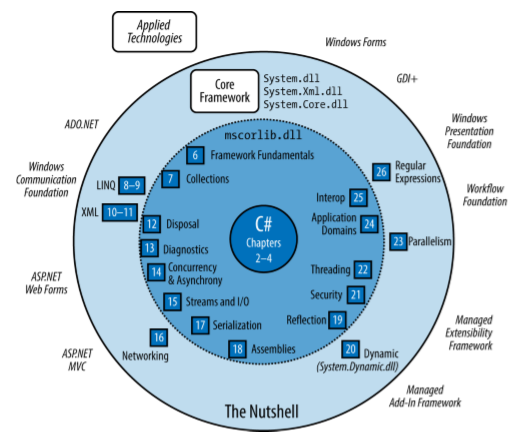

# C# and the .Net Framework

## Miscellaneous

- C# is also called a strongly typed language because its type rules (whether enforced statically or at runtime) are very strict.
  - For instance, you cannot call a function that’s designed to accept an integer with a floating-point number, unless you first explicitly convert the floating-point number to an integer
- C# depends on a runtime equipped with a host of features such as automatic memory management and exception handling
  - At the core of the Microsoft .NET Framework is the Common Language Runtime (CLR), which provides these runtime features
  - The .NET Core and Xamarin frameworks provide similar runtimes
- C# is one of several managed languages that get compiled into managed code. Managed code is represented in Intermediate Language or IL
  - The CLR converts the IL into the native code of the machine, such as X86 or X64, usually just prior to execution. This is referred to as Just-In-Time (JIT) compilation
- The container for managed code is called an __assembly__ or portable executable. An assembly can be an executable file (.exe) or a library (.dll), and contains not only IL, but type information (metadata).
  - The C# compiler compiles source code, specified as a set of files with the .cs extension, into an assembly
  - An assembly is the unit of packaging and deployment in .NET. An assembly can be either an application or a library
  - You can examine and disassemble the contents of an IL assembly with Microsoft’s ildasm tool or JetBrains dotPeek (there are other tools, see Chapter 1 P.4)

## Major Frameworks

- There are currently four major Frameworks, all of which are currently owned by Microsoft:
  - The .NET Framework:
    - consists of the CLR plus a vast set of libraries
    - The libraries consist of core libraries and applied libraries, which depend on the core libraries
  - Universal Windows Platform (UWP):
    - For writing Windows 10 Store Apps and for targeting Windows 10 devices
    - Your app runs in a sandbox to lessen the threat of malware, prohibiting operations such as reading or writing arbitrary files
  - .NET Core with ASP.NET Core:
    - An open source framework (originally based on a cut-down version of the .NET Framework) for writing easily deployable Internet apps and microservices that __run on Windows, macOS, and Linux__
    - Unlike the .NET Framework, .NET Core can be packaged with the web application and xcopydeployed (self-contained deployment)
  - Xamarin:
    - For writing mobile apps that target iOS, Android, and Windows Mobile

The four major frameworks differ in the platforms they support, the libraries that sit on top, and their intended uses.  However, it’s fair to say that as of the release of .NET Core 2.0, they all expose a similar core framework (BCL). It is even possible to directly leverage this commonality by writing class libraries that work across all four frameworks (see “.NET Standard 2.0” on page 215 in Chapter 5).  

Note: A nuance not shown in Table 1-1 is that UWP uses .NET Core under the covers, so technically .NET Core does run on Windows 10 devices (albeit not for the purpose of providing a framework for ASP.NET Core). It’s likely that we’ll see more uses for .NET Core 2 in the future.

Overview of the .Net Framework:

## Legacy and Niche Frameworks

The following frameworks are still available to support older platforms:

- Windows Runtime for Windows 8/8.1 (now UWP)
- Windows Phone 7/8 (now UWP)
- Microsoft XNA for game development (now UWP)
- Silverlight (no longer actively developed since the rise of HTML5 and JavaScript)
- .NET Core 1.x (the predecessor to .NET Core 2.0, with significantly reduced functionality)
- The .NET Micro Framework is for running .NET code on highly resourceconstrained embedded devices (under 1 MB)
- Mono, the open source framework upon which Xamarin sits, also has libraries to develop cross-platform desktop applications on Linux, macOS, and Windows. Not all features are supported, or work fully

## Windows Runtime

C# also interoperates with Windows Runtime (WinRT) technology. WinRT means two things:

- A language-neutral object-oriented execution interface supported in Windows 8 and above (By execution interface, we mean a protocol for calling code that’s (potentially) written in another language)
- A set of libraries baked into Windows 8 and above that support the preceding interface

Somewhat confusingly, the term “WinRT” has historically been used to mean two more things:

- The predecessor to UWP, i.e., the development platform for writing Store apps for Windows 8/8.1, sometimes called “Metro” or “Modern"
- The defunct mobile operating system for RISC-based tablets (“Windows RT”) that Microsoft released in 2011

WinRT is much richer. In part, it is an enhanced version of COM (Component Object Model) that supports .NET, C++, and JavaScript. Unlike Win32, it’s objectoriented and has a relatively rich type system. This means that referencing a WinRT library from C# feels much like referencing a .NET library—you may not even be aware that you’re using WinRT. The WinRT libraries in Windows 10 form an essential part of the UWP platform (UWP relies on both WinRT and .NET Core libraries). What distinguishes WinRT from ordinary COM is that WinRT projects its libraries into a multitude of languages, namely C#, VB, C++, and JavaScript, so that each language sees WinRT types (almost) as though they were written especially for it.

## The .Net Framework

- The .NET Framework is a set of libraries
  - A library is a .dll and is equivalent to an .exe without an entry point, its purpose is to be called upon (referenced) by an application or by other libraries
- The .NET Framework is organized into nested namespaces. For example, this is the namespace that contains types for handling text:
  - using System.Text;
