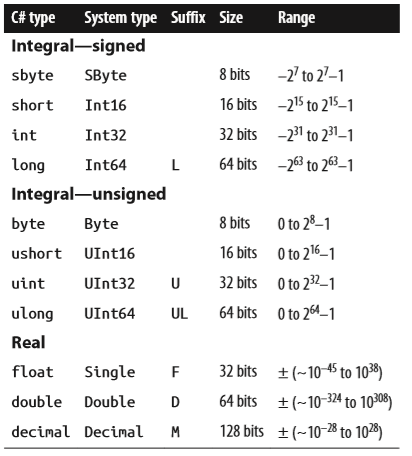
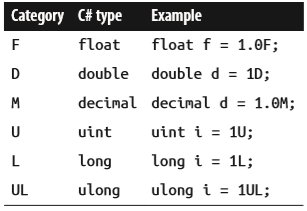
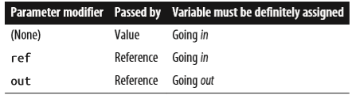

# C# in a nutshell - Language features

## digit separators

- int million = 1_000_000;
- var b = 0b1010_1011_1100_1101_1110_1111;

## Using reserved words

If you really want to use an identifier that clashes with a reserved keyword, you can do so by qualifying it with the @ prefix. For instance:

- class class  {...} // Illegal
- class @class {...} // Legal

The @ symbol doesn’t form part of the identifier itself. So @myVariable is the same as myVariable. The @ prefix can be useful when consuming libraries written in other .NET languages that have different keywords.

## Type Basics

- A variable denotes a storage location that can contain different values over time
- A type defines the blueprint for a value
- All values in C# are instances of a type
- Predefined types are types that are specially supported by the compiler, such as int, double, string, etc.

## Instance versus static members

- The data members and function members that operate on the instance of the type are called instance members
  - By default, members are instance members
- Data members and function members that don’t operate on the instance of the type, but rather on the type itself, must be marked as static
  - Console.WriteLine method is an example of a static method
  - The Console class is actually a static class, which means all its members are static
  - You never actually create instances of a Console—one console is shared across the whole application

## Value Types Versus Reference Types

- Value types comprise most built-in types (specifically, all numeric types, the char type, and the bool type) as well as custom struct and enum types.
  - content is simply a value
  - The assignment of a value-type instance always copies the instance
  - Point p2 = p1; // assignment causes copy
- Reference types comprise all class, array, delegate, and interface types. (This includes the predefined string type.)
  - A reference type is more complex than a value type, having two parts: an object and the reference to that object
  - The content of a reference-type variable or constant is a reference to an object that contains the value.
  - Assigning a reference-type variable copies the reference, not the object instance. This allows multiple variables to refer to the same object
  - Point p2 = p1; // Copies p1 reference

The fundamental difference between value types and reference types is how they are handled in memory.

## Numeric Types



### Numeric literals

- hex: 0x7F, 0x3A
- binary: 0b1010, 0b0011
- exponential: 1E06, 1E09

### Numeric suffixes



## Overflow Checking

The __checked__ operator tells the runtime to generate an OverflowException rather than overflowing silently.

- The checked operator affects expressions with the ++, −−, +, − (binary and unary), *, /, and explicit conversion operators between integral types

Example:

```C#
checked         // Checks all expressions
{               // in statement block.
    ...
    c = a * b;
    ...
}
```

You can make arithmetic overflow checking the default for all expressions in a program by compiling with the /checked+ command-line switch (in Visual Studio, go to Advanced Build Settings).  If you then need to disable overflow checking just for specific expressions or statements, you can do so with the __unchecked__ operator.

More info about Overflow checking P. 35 ff.

## Rectangular arrays

Example:  

```C#
int[,] matrix = new int[3,3];
```

A rectangular array can be initialized as follows:

```C#
var matrix = new int[,]
{  
    {0,1,2},
    {3,4,5},
    {6,7,8}
};
```

## Jagged Arrays

Example:  

```C#
int[][] matrix = new int[3][];
```

The inner dimensions aren’t specified in the declaration because, unlike a rectangular array, each inner array can be an arbitrary length. Each inner array is implicitly initialized to null rather than an empty array. __Each inner array must be created manually:__

```C#
for (int i = 0; i < matrix.Length; i++)
{  
    matrix[i] = new int[3];                     // Create inner array
    for (int j = 0; j < matrix[i].Length; j++)
        matrix[i][j] = i * 3 + j;
}
```

A jagged array can be initialized as follows (to create an array identical to the previous example with an additional element at the end):

```C#
var matrix = new int[][]
{  
    new int[] {0,1,2},
    new int[] {3,4,5},  
    new int[] {6,7,8,9}
};
```

## Parameters

You can control how parameters are passed with the ref and out modifiers:



### Passing arguments by value

By default, arguments in C# are passed by value, which is by far the most common case. This means a copy of the value is created when passed to the method:

```C#
class Test {
    static void Foo (int p){
        p = p + 1;                // Increment p by 1
        Console.WriteLine (p);    // Write p to screen  
    }

    static void Main(){
        int x = 8;
        Foo (x);                  // Make a copy of x
        Console.WriteLine (x);    // x will still be 8  
    }
}
```

Passing a reference-type argument by value copies the reference, but not the object. In the following example, Foo sees the same StringBuilder object that Main instantiated, but has an independent reference to it. In other words, sb and fooSB are separate variables that reference the same StringBuilder object.

### The ref modifier

To pass by reference, C# provides the ref parameter modifier. In the following example, p and x refer to the same memory locations:

```C#
class Test {  
    static void Foo (ref int p)  {
        p = p + 1;               // Increment p by 1
        Console.WriteLine (p);   // Write p to screen
    }
  
    static void Main() {
        int x = 8;
        Foo (ref  x);            // Ask Foo to deal directly with x
        Console.WriteLine (x);   // x is now 9  
    }
}
```

Now assigning p a new value changes the contents of x. Notice how the ref modifier is required both when writing and when calling the method, this makes it very clear what’s going on. The ref modifier is essential in implementing a swap method (later, in “Generics” on page 122 in Chapter 3).

### The out modifier

An out argument is like a ref argument, except it:

- Need not be assigned before going into the function
- Must be assigned before it comes out of the function

The out modifier is most commonly used to get multiple return values back from a method.

```C#
class Test {  
    static void Split (string name, out string firstNames, out string lastName){
        int i = name.LastIndexOf (' ');
        firstNames = name.Substring (0, i);
        lastName   = name.Substring (i + 1);
    }
  
    static void Main() {
    Split ("Stevie Ray Vaughan", out string a, out string b);
    Console.WriteLine (a);         // Stevie Ray
    Console.WriteLine (b);         // Vaughan  
    }
}
```

Like a ref parameter, an out parameter is passed by reference. From C# 7, you can declare variables on the fly when calling methods with out parameters.

When calling methods with multiple out parameters, sometimes you’re not interested in receiving values from all the parameters. In such cases, you can “discard” the ones you’re uninterested in with an underscore:

```C#
Split ("Stevie Ray Vaughan", out string a, out _);   // Discard the 2nd param
Console.WriteLine (a);
```

In this case, the compiler treats the underscore as a special symbol, called a discard. You can include multiple discards in a single call. Assuming SomeBigMethod has been defined with seven out parameters, we can ignore all but the fourth as follows:

```C#
SomeBigMethod (out _, out _, out _, out int x, out _, out _, out _);
```

### The params modifier

The params parameter modifier may be specified on the last parameter of a method so that the method accepts any number of arguments of a particular type. The parameter type must be declared as an array.

Example:

```C#
class Test {  
    static int Sum (params int[] ints)  {
        int sum = 0;
        for (int i = 0; i < ints.Length; i++)
            sum += ints[i];                       // Increase sum by ints[i]
        return sum;
    }
  
    static void Main()  {
        int total = Sum (1, 2, 3, 4);
        Console.WriteLine (total);              // 10  
    }
}
```

You can also supply a params argument as an ordinary array. The first line in Main is semantically equivalent to this:

```C#
int total = Sum (new int[] { 1, 2, 3, 4 } );
```

## Ref locals (C# 7)

C# 7 adds an esoteric feature, whereby you can define a local variable that references an element in an array or field in an object:

```C#
int[] numbers = { 0, 1, 2, 3, 4 };
ref int numRef = ref numbers [2];
```

In this example, numRef is a reference to the numbers[2]. When we modify numRef, we modify the array element:

```C#
numRef *= 10;
Console.WriteLine (numRef);        // 20
Console.WriteLine (numbers [2]);   // 20
```

The target for a ref local must be an array element, field, or local variable; it cannot be a property.

## Ref Returns (C# 7)

You can return a ref local from a method. This is called a ref return:

```C#
static string X = "Old Value";
static ref string GetX() => ref X;    // This method returns a ref

static void Main() {  
    ref string xRef = ref GetX();       // Assign result to a ref local
    xRef = "New Value";
    Console.WriteLine (X);              // New Value
}
```

## null coalescing operator and the null-conditional operator

### Null Coalescing Operator

The ?? operator is the null coalescing operator. It says “If the operand is non-null, give it to me; otherwise, give me a default value.” For example:

```C#
string s1 = null;
string s2 = s1 ?? "nothing";   // s2 evaluates to "nothing" 
```

If the lefthand expression is non-null, the righthand expression is never evaluated. The null coalescing operator also works with nullable value types (see “Nullable Types” on page 173 in Chapter 4).

### Null-conditional Operator (C# 6)

The ?. operator is the null-conditional or “Elvis” operator (after the Elvis emoticon), and is new to C# 6. It allows you to call methods and access members just like the standard dot operator, except that if the operand on the left is null, the expression evaluates to null instead of throwing a NullReferenceException:

```C#
System.Text.StringBuilder sb = null;
string s = sb?.ToString();  // No error; s instead evaluates to null
```

The last line is equivalent to:

```C#
string s = (sb == null ? null : sb.ToString());
```

Upon encountering a null, the Elvis operator short-circuits the remainder of the expression.

In the following example, s evaluates to null, even with a standard dot operator between ToString() and ToUpper():

```C#
System.Text.StringBuilder sb = null;
string s = sb?.ToString().ToUpper();    // s evaluates to null without error
```

Repeated use of Elvis is necessary only if the operand immediately to its left may be null. The following expression is robust to both x being null and x.y being null:

```C#
x?.y?.z
```

and is equivalent to the following (except that x.y is evaluated only once):

```C#
x == null ? null : (x.y == null ? null : x.y.z)
```

__The final expression must be capable of accepting a null.__ The following is illegal:

```C#
System.Text.StringBuilder sb = null;
int length = sb?.ToString().Length;   // Illegal : int cannot be null
```

We can fix this with the use of nullable value types:

```C#
int? length = sb?.ToString().Length;   // OK : int? can be null
```

__You can also use the null-conditional operator to call a void method:__

```C#
someObject?.SomeVoidMethod();
```

__If someObject is null, this becomes a “no-operation” rather than throwing a NullReferenceException.__

## Statements

Functions comprise statements that execute sequentially in the textual order in which they appear. A statement block is a series of statements appearing between braces (the __{}__ tokens).

### Declaration Statements

A declaration statement declares a new variable, optionally initializing the variable with an expression.

### Local variables

The scope of a local variable or local constant extends throughout the current block.

A variable’s scope extends in both directions throughout its code block. This means that if we moved the initial declaration of x in this example to the bottom of the method, we’d get the same error. This is in contrast to C++ and is somewhat peculiar, given that it’s not legal to refer to a variable or constant before it’s declared.

### Expression Statements

Expression statements are expressions that are also valid statements. An expression statement must either change state or call something that might change state. Changing state essentially means changing a variable. The possible expression statements are:

- Assignment expressions (including increment and decrement expressions)
- Method call expressions (both void and nonvoid)
- Object instantiation expressions

#### Examples

```C#
// Declare variables with declaration statements:
string s;
int x, y;
System.Text.StringBuilder sb;

// Expression statements
x = 1 + 2;                 // Assignment expression
x++;                       // Increment expression
y = Math.Max (x, 5);       // Assignment expression
Console.WriteLine (y);     // Method call expression
sb = new StringBuilder();  // Assignment expression
new StringBuilder();       // Object instantiation expression
```

### Selection Statements

C# has the following mechanisms to conditionally control the flow of program execution:

- Selection statements (if, switch)
- Conditional operator (?:)
- Loop statements (while, do..while, for, foreach)

### Switching on types

From C# 7, you can switch on types:

```C#
static void Main()
{
    TellMeTheType (12);
    TellMeTheType ("hello");
    TellMeTheType (true);
}

static void TellMeTheType (object x)   // object allows any type.
{
    switch (x)
    {
        case int i:
            Console.WriteLine ("It's an int!");
            Console.WriteLine ($"The square of {i} is {i * i}");
            break;
        case string s:
            Console.WriteLine ("It's a string");
            Console.WriteLine ($"The length of {s} is {s.Length}");
            break;
        default:
            Console.WriteLine ("I don't know what x is");
            break;
    }
}
```

Each case clause specifies a type upon which to match, and a variable upon which to assign the typed value if the match succeeds (see the “pattern” variable). Unlike with constants, there’s no restriction on what types you can use.

You can predicate a case with the when keyword:

```C#
switch (x)
{
    case bool b when b == true:     // Fires only when b is true
        Console.WriteLine ("True!");
        break;

    case bool b:
        Console.WriteLine ("False!");
        break;
}
```

__The order of the case clauses can matter when switching on type__ (unlike when switching on constants). This example would give a different result if we reversed the two cases (in fact, it would not even compile, because the compiler would determine that the second case is unreachable)! __An exception to this rule is the default clause, which is always executed last, regardless of where it appears.__

You can stack multiple case clauses. The Console.WriteLine in the following code will execute for any floating-point type greater than 1000:

```C#
switch (x)
{
    case float f when f > 1000:
    case double d when d > 1000:
    case decimal m when m > 1000:
        Console.WriteLine ("We can refer to x here but not f or d or m");
        break;
}
```

__In this example, the compiler lets us consume the pattern variables f, d, and m, only in the when clauses.__ When we call Console.WriteLine, it’s unknown as to which one of those three variables will be assigned, so the compiler puts all of them out of scope.

You can mix and match constants and patterns in the same switch statement. And you can also switch on the null value:

```C#
case null:
    Console.WriteLine ("Nothing here");
    break;
```

### Iteration statements

Example for multiple variable declarations in a for statement (Fibonacci numbers):

```C#
for (int i = 0, prevFib = 1, curFib = 1; i < 10; i++)
{
    Console.WriteLine (prevFib);
    int newFib = prevFib + curFib;
    prevFib = curFib;
    curFib = newFib;
}
```

### break vs continue

- The break statement ends the execution of the body of an iteration or switch statement
- The continue statement forgoes the remaining statements in a loop and makes an early start on the next iteration

### The goto statement

The goto statement transfers execution to another label withing a statement block. Most similar to branching in assembler languages.

Syntax:

```C#
goto statement-label;
```

or when used within a switch statement:

```C#
goto case case-constant;
```

A label is a placeholder in a code block that precedes a statement, denoted with a colon suffix.
Example, which iterates the numbers 1 trough 5, mimicking a for loop:

```C#
int i = 1;
startLoop:
if (i <= 5)
{
    Console.Write(i + " ");
    i++;
    goto startLoop;
}
```

Output: 1 2 3 4 5

### The lock statement

The lock statement is a shortcut for calling the Enter and Exit mehtods of the Monitor class.

## Namespaces

A namespace is a domain for type names. Types are typically organized into hierarchical namespaces, making them easier to find and avoiding conflicts. Namespaces are independent of assemblies, which are units of deployment such as an ".exe" or ".dll". Namespaces also have no impact on member visibility (no access modifiers).

Types not defined in any namespace are said to reside in the global namespace. The global namespace also includes top-level namespaces (The outermost namespaces like System).

It's legal (and often desirable) to define the same type name in different namespaces. Howeverm you'd typically do so only if it was unlikely for a consumer to want to import both namespaces.

Namespace declarations can be repeated, as long as the type names within the namespaces don't conflict. They can also be broken into multiple source files such that they could compile each class into a different assembly.

### using static

From C#, you can import not just a namespace, but a specific type, with the using static directive. All static members of that type can then be used without being qualified with the type name.

Example using Console class's static WriteLine method:

```C#
using static System.Console;

class Test
{
    static void Main() { WriteLine("Hello"); }
}
```

The using static directive imports all accessible static members of the type, including fields, properties, and nested types. It can also be applied to enum types, in which case their members are imported:

```C#
using static System.Windows.Visibility;
```

we can specify Hidden instead of Visibility.Hidden:

```C#
var textBox = new TestBox { Visibility = Hidden };  // XAML-style
```

Should ambiguity arise between multiple static imports, the C# compiler is not smart enough to infer the correct type from the context, and will generate an error.

### Name hiding

If the same type name appears in both an inner and an outer namespace, the inner name wins. To refer to the type in the outer namespace, you must qualify its name.

Example:

```C#
namespace Outer
{
    class Foo { }

    namespace Inner
    {
        class Foo { }

        class Test
        {
            Foo f1;         // = Outer.Inner.Foo
            Outer.Foo f2;   // = Outer.Foo
        }
    }
}
```

### Nested using directive

You can nest a using directive withing a namespace. This allows you to scope the using directive within a namespace declaration. In the following example, Class1 is visible in one scope, but not in another:

```C#
namespace N1
{
    class Class1 {}
}

namespace N2
{
    using N1;
    class Class2 : Class1 {}
}

namespace N2
{
    class Class3 : Class1 {}   // Compile-time error
}
```

### Aliasing Types and Namespaces

Importign a namespace can result in type-name collision. Rather than importing the whole namespace, you can import just the specific types you need, giving each type an alias:

```C#
using PropertyInfo2 = System.Reflection.PropertyInfo;

class Program
{
    PropertyInfo2 p;
}
```

An entire namespace can also be aliased:

```C#
using R = System.Reflection;

class Program
{
    R.PropertyInfo p;
}
```

### Advanced namespace features

#### Extern

Extern aliases allow your program to reference two types with the same fully qualified name (i.e. the namespace and type name are identical). This is an unusual scenario and can occur only when the two types come from different assemblies.

Example:

Library 1:

```C#
// csc target:library /out:Widgets1.dll widgetsv1.cs
namespace Widgets
{
    public class Widget {}
}
```

Library 2:

```C#
// csc target:library /out:Widgets2.dll widgetsv2.cs
namespace Widgets
{
    public class Widget {}
}
```

Application:

```C#
// csc /r:Widgets1.dll /r:Widgets2.dll application.cs
using Widgets;

class Test
{
    static void Main()
    {
        Widget w = new Widget();
    }
}
```

__The application cannot compile, because Widget is ambiguous.__ Extern aliases can resolve the ambiguity in our application:

```C#
// csc /r:W1=Widgets1.dll /r:W2=Widgets2.dll application.cs
extern alias W1;
extern alias W2;

class Test {
    static void Main()
    {
        W1.Widgets.Widget w1 = new W1.Widgets.Widget();
        W2.Widgets.Widget w2 = new W2.Widgets.Widget();
    }
}
```

### Namespace alias qualifiers

Names in inner namespaces hide names in outer namespaces. Sometimes even the fully qualified type name does not resolve the conflict. For example:

```C#
namespace N
{
    class A
    {
        public class B {}   // Nested type

        static void Main(){ new A.B(); }    // Instantiate class B
    }
}

namespace A
{  
    class B {}
}
```

The Main method could be instantiating either the nested class B, or the class B within the namespace A. __The compiler always gives higher precedence to identifiers in the current namespace; in this case, the nested B class.__

To resolve such conflicts, a namespace name can be qualified, relative to one of the following:

- The global namespace—the root of all namespaces (identified with the contextual keyword global)
- The set of extern aliases

The __::__ token is used for namespace alias qualification. In this example, we qualify using the global namespace (this is most commonly seen in auto-generated code to avoid name conflicts):

```C#
namespace N {
    class A
    {
        static void Main()
        {
            System.Console.WriteLine (new A.B());
            System.Console.WriteLine (new global::A.B());
        }

    public class B {}
    }
}

namespace A
{
    class B {}
}
```

Here is an example of qualifying with an alias (adapted from the example of "extern"):

```C#
extern alias W1;
extern alias W2;

class Test
{
    static void Main()
    {
        W1::Widgets.Widget w1 = new W1::Widgets.Widget();
        W2::Widgets.Widget w2 = new W2::Widgets.Widget();
    }
}
```

## Chapter 3 - Creating Types

This chapter deals with types and type members.

## Classes

A class is the most common kind of reference type. The simplest possible class declaration is as follows:

```C#
class YourClassName{}
```

A more complex class optionally has the following:

|||
|--------|----------|
|Preceding the keyword class|Attributes and class modifiers. The non-nested class modifiers (public, internal, abstract, sealed, static, unsafe, partial)|
|Following the class name|Generic type parameters, a base class, and interfaces|
|Within the braces|Class members (these are methods, properties, indexers, events, fields, constructors, overloaded operators, nested types, and a finalizer)|

## Fields

A field is a variable that is a member of a class or struct. For example:

```C#
class Octopus
{
string name;            // field
public int Age = 10;    // field
}
```

Fields allow the following modifiers:

- static modifier: static
- access modifiers: public, internal, private, protected
- inheritance modifier: new
- unsafe code modifier: unsafe
- read-only modifier: readonly
- threading modifier: volatile

### readonly modifier

The readonly modifier prevents a field from being modified after construction. A read-only field can be assigned only in its declaration or within the enclosing type's constructor.

### Field initialization

Field initialization is optional. An uninitialized field has a default value (0, \0, null, false). Field initializers run before constructors!

### Declaring multiple fields together

For convenience, you may declare multiple fields of the same type in a commaseparated list. This is a convenient way for all the fields to share the same attributes and field modifiers. For example:

```C#
static readonly int legs = 8, eyes = 2;
```

## Methods

A method performs an action in a series of statements. A method can receive input data from the caller by specifying parameters and output data back to the caller by specifying a return type. A method can also output data back to the caller via ref/out parameters.

A method’s signature must be unique within the type. A method’s signature comprises its name and parameter types in order (but not the parameter names, nor the return type).

Methods allow the following modifiers:

- static modifier: static
- access modifiers: public, internal, private, protected
- inheritance modifier: new, virtual, abstract, override, sealed
- partial method modifier: partial
- unmanaged code modifiers: unsafe, extern
- asynchronous code modifer: async

### Expression-bodied methods (C# 6)

A method that comprises a single expression, such as the following:

```C#
int Foo (int x) { return x * 2; }
```

can be written more tersely as an expression-bodied method. A fat arrow replaces the braces and return keyword:

```C#
int Foo (int x) => x * 2;
```

Expression-bodied functions can also have a void return type:

```C#
void Foo (int x) => Console.WriteLine (x);
```

### Overloading methods

A type may overload methods (have multiple methods with the same name), as long as the signatures are different. Whether a parameter is pass-by-value or pass-by-reference is also part of the signature. For example, Foo(int) can coexist with either Foo(ref int) or Foo(out int). However, Foo(ref int) and Foo(out int) cannot coexist:

```C#
void Foo (int x) {...}
void Foo (ref int x {...}     // OK so far
void Foo (out int x) {...}    // Compile-time error
```

### Local methods (C# 7)

From C# 7, __you can define a method inside another method__:

```C#
void WriteCubes()
{
    Console.WriteLine (Cube (3));
    Console.WriteLine (Cube (4));
    Console.WriteLine (Cube (5));

    int Cube (int value) => value * value * value;
}
```

The local method (Cube, in this case) is visible only to the enclosing method (Write Cubes). This simplifies the containing type and instantly signals to anyone looking at the code that Cube is used nowhere else. Another benefit of local methods is that they can access the local variables and parameters of the enclosing method.

Local methods can appear inside other function kinds, such as property accessors, constructors, and so on. You can even put local methods inside other local methods, and inside lambda expressions that use a statement block. Local methods can be iterators (Chapter 4) or asynchronous (Chapter 14).

The static modifier is invalid for local methods. They are implicitly static if the enclosing method is static.

## Instance Constructors

Constructors run initialization code on a class or struct. A constructor is defined like a method, except that the method name and return type are reduced to the name of the enclosing type.

Instance constructors allow the following modifiers:

- access modifiers: public, internal, private, protected
- unmanaged code modifiers: unsafe, extern

From C# 7, single-statement constructors can also be written as expression-bodied members:

```C#
public Panda (string n) => name = n;
```

### Overloading constructors

A class or struct may overload constructors. To avoid code duplication, one constructor may call another, using the this keyword:

```C#
using System;

public class Wine
{
    public decimal Price;
    public int Year;

    public Wine (decimal price) { Price = price; }
    public Wine (decimal price, int year) : this (price) { Year = year; }
}
```

When one constructor calls another, the called constructor executes first.

You can pass an expression into another constructor as follows:

```C#
public Wine (decimal price, DateTime year) : this (price, year.Year) { }
```

The expression itself cannot make use of the this reference, for example, to call an instance method. (This is enforced because the object has not been initialized by the constructor at this stage, so any methods that you call on it are likely to fail.) It can, however, call static methods.

### Implicit parameterless constructors

__For classes, the C# compiler automatically generates a parameterless public constructor if and only if you do not define any constructors.__ However, as soon as you define at least one constructor, the parameterless constructor is no longer automatically generated.

### Constructor and field initialization order

Field initializations occur before the constructor is executed, and in the declaration order of the fields.

### Nonpublic constructors

Constructors do not need to be public. A common reason to have a nonpublic constructor is to control instance creation via a static method call. The static method could be used to return an object from a pool rather than necessarily creating a new object, or return various subclasses based on input arguments:

```C#
public class Class1
{
    Class1() {} // Private constructor

    public static Class1 Create (...)
    {
        // Perform custom logic here to return an instance of Class1
        ...
    }
}
```

## Deconstructors (C# 7)

A deconstructor (also called a deconstructing method) acts as an approximate opposite to a constructor: Whereas a constructor typically takes a set of values (as parameters) and assigns them to fields, a deconstructor does the reverse and assigns fields back to a set of variables.

A deconstruction method must be called Deconstruct, and have one or more out parameters, such as in the following class:

```C#
class Rectangle
{
    public readonly float Width, Height;

    public Rectangle (float width, float height)
    {
        Width = width;    Height = height;
    }

    public void Deconstruct (out float width, out float height)
    {
        width = Width;
        height = Height;
    }
}
```

To call the deconstructor, we use the following special syntax:

```C#
var rect = new Rectangle (3, 4);
(float width, float height) = rect;          // Deconstruction
Console.WriteLine (width + " " + height);    // 3 4
```

The second line is the deconstructing call. It creates two local variables and then calls the Deconstruct method. Our deconstructing call is equivalent to:

```C#
float width, height;
rect.Deconstruct (out width, out height);
```

or

```C#
rect.Deconstruct (out var width, out var height);
```

Deconstructing calls allow implicit typing, so we could shorten our call to:

```C#
(var width, var height) = rect;
```

or

```C#
var (width, height) = rect;
```

If the variables into which you’re deconstructing are already defined, omit the types altogether:

```C#
float width, height;
(width, height) = rect;
```

This is called a deconstructing assignment. You can offer the caller a range of deconstruction options by overloading the Deconstruct method. The Deconstruct method can be an extension method, this is a useful trick if you want to deconstruct types you did not author.

## Object Initializers

To simplify object initialization, any accessible fields or properties of an object can be set via an object initializer directly after construction. For example, consider the following class:

```C#
public class Bunny
{
    public string Name;
    public bool LikesCarrots;
    public bool LikesHumans;
    public Bunny () {}
    public Bunny (string n) { Name = n; }
}
```

Using object initializers, you can instantiate Bunny objects as follows:

```C#
// Note parameterless constructors can omit empty parentheses
Bunny b1 = new Bunny { Name="Bo", LikesCarrots=true, LikesHumans=false };
Bunny b2 = new Bunny ("Bo")     { LikesCarrots=true, LikesHumans=false };
```

The code to construct b1 and b2 is precisely equivalent to:

```C#
Bunny temp1 = new Bunny();    // temp1 is a compiler-generated name
temp1.Name = "Bo";
temp1.LikesCarrots = true;
temp1.LikesHumans = false;

Bunny b1 = temp1;
Bunny temp2 = new Bunny ("Bo");
temp2.LikesCarrots = true;
temp2.LikesHumans = false;
Bunny b2 = temp2;
```

The temporary variables are to ensure that if an exception is thrown during initialization, you can’t end up with a half-initialized object.

### Object Initializers Versus Optional Parameters

Instead of using object initializers, we could make Bunny’s constructor accept optional parameters:

```C#
public Bunny (string name, bool likesCarrots = false, bool likesHumans = false)
{
    Name = name;
    LikesCarrots = likesCarrots;
    LikesHumans = likesHumans;
}
```

This would allow us to construct a Bunny as follows:

```C#
Bunny b1 = new Bunny (name: "Bo", likesCarrots: true);
```

An advantage of this approach is that we could make Bunny’s fields (or properties, as we’ll explain shortly) read-only if we choose. Making fields or properties read-only is good practice when there’s no valid reason for them to change throughout the life of the object.

The disadvantage in this approach is that each optional parameter value is baked into the calling site. In other words, C# translates our constructor call into this:

```C#
Bunny b1 = new Bunny ("Bo", true, false);
```

__This can be problematic if we instantiate the Bunny class from another assembly, and later modify Bunny by adding another optional parameter—such as likesCats. Unless the referencing assembly is also recompiled, it will continue to call the (now nonexistent) constructor with three parameters and fail at runtime.__ (A subtler problem is that if we changed the value of one of the optional parameters, callers in other assemblies would continue to use the old optional value until they were recompiled.) Hence, you should exercise caution with optional parameters in public functions if you want to offer binary compatibility between assembly versions.

### The this Reference

The this reference refers to the instance itself. The this reference also disambiguates a local variable or parameter from a field. For example:

```C#
public class Test
{
    string name;
    public Test(string name)
    {
        this.name = name;
    }
}
```

The this reference is valid only within nonstatic members of a class or struct.

## Properties

Properties look like fields from the outside, but internally they contain logic, like methods do. A property is declared like a field, but with a get/set block added.

Example:

```C#
public class Stock
{
    decimal currentPrice;           // The private "backing" field
    public decimal CurrentPrice     // The public property
    {
        get { return currentPrice; }
        set { currentPrice = value; }
    }
}
```

Get and set denote property accessors. The get accessor runs when the property is read. It must return a value of the property’s type. The set accessor runs when the property is assigned. It has an implicit parameter named value of the property’s type that you typically assign to a private field (in this case, currentPrice).

Although properties are accessed in the same way as fields, they differ in that they give the implementer complete control over getting and setting its value. This control enables the implementer to choose whatever internal representation is needed, without exposing the internal details to the user of the property. __In this example, the set method could throw an exception if value was outside a valid range of values.__

Properties allow the following modifiers:

- static modifier: static
- acceess modifiers: public, internal, private, protected
- inheritance modifiers: new, virtual, abstact, override, sealed
- unmanaged code modifiers: unsafe, extern

### Read-only and calculated properties

A property is read-only if it specifies only a get accessor, and it is write-only if it specifies only a set accessor. Write-only properties are rarely used.

A property typically has a dedicated backing field to store the underlying data. However, a property can also be computed from other data. For example:

```C#
decimal currentPrice, sharesOwned;
public decimal Worth
{
    get { return currentPrice * sharesOwned; }
}
```

### Expression-bodied properties (C# 6, C# 7)

From C# 6, you can declare a read-only property, such as the preceding example, more tersely as an expression-bodied property. A fat arrow replaces all the braces and the get and return keywords:

```C#
public decimal Worth => currentPrice * sharesOwned;
```

C# 7 extends this further by allowing set accessors to be expression-bodied, with a little extra syntax:

```C#
public decimal Worth
{
    get => currentPrice * sharesOwned;
    set => sharesOwned = value / currentPrice;
}
```

### Automatic properties

__The most common implementation for a property is a getter and/or setter that simply reads and writes to a private field of the same type as the property. An automatic property declaration instructs the compiler to provide this implementation.__

We can improve the first example in this section by declaring CurrentPrice as an automatic property:

```C#
public class Stock
{
    ...
    public decimal CurrentPrice { get; set; }
}
```

__The compiler automatically generates a private backing field of a compilergenerated name that cannot be referred to.__ The set accessor can be marked private or protected if you want to expose the property as read-only to other types. Automatic properties were introduced in C# 3.0.

### Property initializers (C# 6)

From C# 6, you can add a property initializer to automatic properties, just as with fields:

```C#
public decimal CurrentPrice { get; set; } = 123;
```

This gives CurrentPrice an initial value of 123. Properties with an initializer can be read-only:

```C#
public int Maximum { get; } = 999;
```

Just as with read-only fields, read-only automatic properties can also be assigned in the type’s constructor. This is useful in creating immutable (read-only) types.

#### get and set accessibility

The get and set accessors can have different access levels. The typical use case for this is to have a public property with an internal or private access modifier on the setter:

```C#
public class Foo
{
    private decimal x;
    public decimal X
    {
        get { return x; }
        private set { x = Math.Round (value, 2); }
    }
}
```

Notice that you declare the property itself with the more permissive access level (public, in this case), and add the modifier to the accessor you want to be less accessible.

### CLR property implementation

C# property accessors internally compile to methods called get_XXX and set_XXX:

```C#
public decimal get_CurrentPrice {...}
public void set_CurrentPrice (decimal value) {...}
```

Simple nonvirtual property accessors are inlined by the JIT (Just-In-Time) compiler, eliminating any performance difference between accessing a property and a field. Inlining is an optimization in which a method call is replaced with the body of that method.

With WinRT properties, the compiler assumes the put_XXX naming convention rather than set_XXX.

## Indexers

Indexers provide a natural syntax for accessing elements in a class or struct that encapsulate a list or dictionary of values. Indexers are similar to properties, but are accessed via an index argument rather than a property name. The string class has an indexer that lets you access each of its char values via an int index:

```C#
string s = "hello";
Console.WriteLine (s[0]); // 'h'
Console.WriteLine (s[3]); // 'l'
```

The syntax for using indexers is like that for using arrays, except that the index argument(s) can be of any type(s).
Indexers have the same modifiers as properties and can be called null-conditionally by inserting a question mark before the square bracket:

```C#
string s = null;
Console.WriteLine (s?[0]); // Writes nothing; no error.
```

### Implementing an indexer

To write an indexer, define a property called this, specifying the arguments in
square brackets. For instance:

```C#
class Sentence
{
    string[] words = "The quick brown fox".Split();

    public string this [int wordNum] // indexer
    {
        get { return words [wordNum]; }
        set { words [wordNum] = value; }
    }
}
```

Here’s how we could use this indexer:

```C#
Sentence s = new Sentence();
Console.WriteLine (s[3]); // fox

s[3] = "kangaroo";
Console.WriteLine (s[3]); // kangaroo
```

A type may declare multiple indexers, each with parameters of different types. An
indexer can also take more than one parameter:

```C#
public string this [int arg1, string arg2]
{
 get { ... } set { ... }
}
```

If you omit the set accessor, an indexer becomes read-only, and expression-bodied
syntax may be used in C# 6 to shorten its definition:

```C#
public string this [int wordNum] => words [wordNum];
```

### CLR indexer implementation

Indexers internally compile to methods called get_Item and set_Item, as follows:

```C#
public string get_Item (int wordNum) {...}
public void set_Item (int wordNum, string value) {...}
```

## Constants

A constant is a static field whose value can never change. A constant is evaluated statically at compile time and the compiler literally substitutes its value whenever used (rather like a macro in C++). A constant can be any of the built-in numeric types, bool, char, string, or an enum type.

Example of declaration:

```C#
public const string Message = "Hello World";
```

__A constant is much more restrictive than a static readonly field—both in the
types you can use and in field initialization semantics.__ A constant  also differs from a
static readonly field in that the evaluation of the constant occurs at compile time.
For example:

```C#
public static double Circumference (double radius)
{
    return 2 * System.Math.PI * radius;
}
```

is compiled to:

```C#
public static double Circumference (double radius)
{
    return 6.2831853071795862 * radius;
}
```

It makes sense for PI to be a constant, since it can never change. In contrast, a
static readonly field can have a different value per application.

__Note:__ A static readonly field is also advantageous when exposing
to other assemblies a value that might change in a later ver‐
sion. For instance, suppose assembly X exposes a constant as
follows:

```C#
public const decimal ProgramVersion = 2.3;
```

__If assembly Y references X and uses this constant, the value 2.3
will be baked into assembly Y when compiled. This means that
if X is later recompiled with the constant set to 2.4, Y will still
use the old value of 2.3 until Y is recompiled. A static
readonly field avoids this problem.__

Another way of looking at this is that any value that might
change in the future is not constant by definition, and so
should not be represented as one.

Nonlocal constants allow the following modifiers:

- access modifiers: public, internal, private, protected
- inheritance modifier: new

## Static Constructors

__A static constructor executes once per type, rather than once per instance.__ A type
can define only one static constructor, and it __must be parameterless__ and have the
same name as the type:

```C#
class Test
{
    static Test() { Console.WriteLine ("Type Initialized"); }
}
```

The runtime automatically invokes a static constructor just prior to the type being
used. Two things trigger this:

- Instantiating the type
- Accessing a static member in the type

The only modifiers allowed by static constructors are unsafe and extern.

__Note:__ If a static constructor throws an unhandled exception, that type becomes unusable for the life of the application.

### Static constructors and field initialization order

Static field initializers run just before the static constructor is called. If a type has no
static constructor, field initializers will execute just prior to the type being used—or
anytime earlier at the whim of the runtime.

Static field initializers run in the order in which the fields are declared. The follow‐
ing example illustrates this: X is initialized to 0 and Y is initialized to 3.

```C#
class Foo
{
    public static int X = Y; // 0
    public static int Y = 3; // 3
}
```

If we swap the two field initializers around, both fields are initialized to 3. __The next
example prints 0 followed by 3 because the field initializer that instantiates a Foo
executes before X is initialized to 3:__

```C#
class Program
{
    static void Main() { Console.WriteLine (Foo.X); } // 3
}

class Foo
{
    public static Foo Instance = new Foo();
    public static int X = 3;
    Foo() { Console.WriteLine (X); } // 0
}
```

If we swap the two first lines of the Foo class the example prints 3 followed by 3.

## Static Classes

A class can be marked static, indicating that it __must be composed solely of static
members and cannot be subclassed.__ The System.Console and System.Math classes
are good examples of static classes.

## Finalizers

Finalizers are __class-only methods that execute before the garbage collector reclaims
the memory for an unreferenced object.__ The syntax for a finalizer is the name of the
class prefixed with the ~ symbol:

```C#
class Class1
{
    ~Class1()
    {
        ...
    }
}
```

__This is actually C# syntax for overriding Object’s Finalize method__, and the com‐
piler expands it into the following method declaration:

```C#
protected override void Finalize()
{
    ...
    base.Finalize();
}
```

Finalizers allow the following modifier:

- unmanaged code modifier: unsafe

From C# 7, single-statement finalizers can be written with expression-bodied
syntax:

```C#
~Class1() => Console.WriteLine ("Finalizing");
```

## Partial Types and Methods

Partial types __allow a type definition to be split__ - typically across multiple files. A common scenario is for a partial class to be auto-generated from some other source (such as a Visual Studio template or designer), and for that class to be augmented with additional hand-authored methods. For example:

```C#
// PaymentFormGen.cs - auto-generated
partial class PaymentForm { ... }

// PaymentForm.cs - hand-authored
partial class PaymentForm { ... }
```

Each participant must have the partial declaration; __the following is illegal__:

```C#
partial class PaymentForm {}
class PaymentForm {}
```

Participants cannot have conflicting members. A constructor with the same parameters, for instance, cannot be repeated. Partial types are resolved entirely by the compiler, which means that __each participant must be available at compile time and
must reside in the same assembly.__

You can specify a base class on one or more partial class declarations, as long as the
base class, if specified, is the same. In addition, each participant can independently
specify interfaces to implement.

The compiler makes no guarantees with regard to field initialization order between
partial type declarations.

## Partial methods

A partial type may contain partial methods. These let an auto-generated partial type
provide customizable hooks for manual authoring. For example:

```C#
partial class PaymentForm // In auto-generated file
{
    ...
    partial void ValidatePayment (decimal amount);
}
partial class PaymentForm // In hand-authored file
{
    ...
    partial void ValidatePayment (decimal amount)
    {
        if (amount > 100)
        ...
    }
}
```

__A partial method consists of two parts: a definition and an implementation.__ The def‐
inition is typically written by a code generator, and the implementation is typically
manually authored. If an implementation is not provided, the definition of the par‐
tial method is compiled away (as is the code that calls it).

Partial methods must be void and are implicitly private.

## The nameof Operator (C# 6)

The nameof operator __returns the name of any symbol__ (type, member, variable, and
so on) as a string:

```C#
int count = 123;
string name = nameof (count); // name is "count"
```

Its advantage over simply specifying a string is that of static type checking. Tools
such as Visual Studio can understand the symbol reference, so if you rename the
symbol in question, all its references will be renamed, too.

To specify the name of a type member such as a field or property, include the type
as well. This works with both static and instance members:

```C#
string name = nameof (StringBuilder.Length);
```

This evaluates to “Length”. To return “StringBuilder.Length”, you would do this:

```C#
nameof (StringBuilder) + "." + nameof (StringBuilder.Length);
```

## Inheritance

A class can inherit from another class __to extend or customize the original class__.
Inheriting from a class lets you reuse the functionality in that class instead of build‐
ing it from scratch. __A class can inherit from only a single class, but can itself be
inherited by many classes__, thus forming a class hierarchy.

__Note:__ A derived class is also called a subclass. A base class is also called a superclass.

## Polymorphism

__References are polymorphic. This means a variable of type x can refer to an object
that subclasses x.__ Polymorphism works on the basis that subclasses have all the
features of their base class. The converse, however, is not true.

## Casting and Reference Conversions

__An object reference can be:__

- Implicitly upcast to a base class reference
- Explicitly downcast to a subclass reference

Upcasting and downcasting between compatible reference types performs reference
conversions: a new reference is (logically) created that points to the same object. __An
upcast always succeeds; a downcast succeeds only if the object is suitably typed.__

### Upcasting

An upcast operation creates a base class reference from a subclass reference. For
example:

```C#
// Stock inherits from Asset
Stock msft = new Stock();
Asset a = msft; // Upcast
```

After the upcast, variable a still references the same Stock object as variable msft.
The object being referenced is not itself altered or converted. Although a and msft refer to the identical object, a has a more restrictive view on that object, and cannot use methods which are only declared for Stock.

### Downcasting

A downcast operation creates a subclass reference from a base class reference. For example:

```C#
Stock msft = new Stock();
Asset a = msft; // Upcast
Stock s = (Stock)a; // Downcast

Console.WriteLine (s.SharesOwned); // <No error>
Console.WriteLine (s == a); // True
Console.WriteLine (s == msft); // True
```

As with an upcast, only references are affected—not the underlying object. A downcast requires an explicit cast because it can potentially fail at runtime. If a downcast fails, an InvalidCastException is thrown. This is an example of runtime type checking.

## The as operator

The as operator performs a downcast that evaluates to null (rather than throwing
an exception) if the downcast fails:

```C#
Asset a = new Asset();
Stock s = a as Stock; // s is null; no exception thrown
```

This is useful when you’re going to subsequently test whether the result is null:

```C#
if (s != null) Console.WriteLine (s.SharesOwned);
```

The as operator cannot perform custom conversions and it cannot do numeric conversions:

```C#
long x = 3 as long; // Compile-time error
```

Note: The as and cast operators will also perform upcasts, although
this is not terribly useful because an implicit conversion will
do the job.

## The is operator

The is operator __tests whether a reference conversion would succeed__; in other
words, whether an object derives from a specified class (or implements an inter‐
face). __It is often used to test before downcasting.__

```C#
if (a is Stock)
    Console.WriteLine (((Stock)a).SharesOwned);
```

The is operator also evaluates to true if an unboxing conversion would succeed. However, it does not consider custom or numeric
conversions.

### The is operator and pattern variables (C# 7)

From C# 7, you can introduce a variable while using the is operator:

```C#
if (a is Stock s)
    Console.WriteLine (s.SharesOwned);
```

This is equivalent to:

```C#
Stock s;
if (a is Stock)
{
    s = (Stock) a;
    Console.WriteLine (s.SharesOwned);
}
```

__The variable that you introduce is available for “immediate” consumption__, so the
following is legal:

```C#
if (a is Stock s && s.SharesOwned > 100000)
    Console.WriteLine ("Wealthy");
```

And it remains in scope outside the is-expression, allowing this:

```C#
if (a is Stock s && s.SharesOwned > 100000)
    Console.WriteLine ("Wealthy");
else
    s = new Stock(); // s is in scope

Console.WriteLine (s.SharesOwned); // Still in scope
```

## Virtual Function Members

A function marked as virtual __can be overridden by subclasses wanting to provide a
specialized implementation.__ Methods, properties, indexers, and events can all be
declared virtual:

```C#
public class Asset
{
    public string Name;
    public virtual decimal Liability => 0; // Expression-bodied property
}
```

A subclass overrides a virtual method by applying the override modifier:

```C#
public class Stock : Asset
{
    public long SharesOwned;
}
public class House : Asset
{
    public decimal Mortgage;
    public override decimal Liability => Mortgage;  // override modifier
}
```

By default, the Liability of an Asset is 0. A Stock does not need to specialize this
behavior. However, the House specializes the Liability property to return the
value of the Mortgage:

```C#
House mansion = new House { Name="McMansion", Mortgage=250000 };
Asset a = mansion;
Console.WriteLine (mansion.Liability); // 250000
Console.WriteLine (a.Liability); // 250000
```

__The signatures, return types, and accessibility of the virtual and overridden methods
must be identical. An overridden method can call its base class implementation via
the base keyword.__

__Note:__ Calling virtual methods from a constructor is potentially dangerous because authors of subclasses are unlikely to know,
when overriding the method, that they are working with a partially initialized object. In other words, the overriding
method may end up accessing methods or properties that rely on fields not yet initialized by the constructor.

## Abstract Classes and Abstract Members

A class declared as abstract can never be instantiated. Instead, only its concrete subclasses can be instantiated.

Abstract classes are able to define abstract members. __Abstract members are like vir‐
tual members, except they don’t provide a default implementation. That implemen‐
tation must be provided by the subclass, unless that subclass is also declared
abstract:__

```C#
public abstract class Asset
{
    // Note empty implementation
    public abstract decimal NetValue { get; }
}
public class Stock : Asset
{
    public long SharesOwned;
    public decimal CurrentPrice;

    // Override like a virtual method.
    public override decimal NetValue => CurrentPrice * SharesOwned;
}
```

## Hiding Inherited Members

A base class and a subclass may define identical members. For example:

```C#
public class A { public int Counter = 1; }
public class B : A { public int Counter = 2; }
```

The Counter field in class B is said to hide the Counter field in class A. Usually, this
happens by accident, when a member is added to the base type after an identical
member was added to the subtype. For this reason, __the compiler generates a warn‐
ing, and then resolves the ambiguity as follows:__

- References to A (at compile time) bind to A.Counter
- References to B (at compile time) bind to B.Counter

Occasionally, you want to hide a member deliberately, in which case you can apply
the new modifier to the member in the subclass. The new modifier does nothing more
than suppress the compiler warning that would otherwise result:

```C#
public class A { public int Counter = 1; }
public class B : A { public new int Counter = 2; }
```

The __new__ modifier communicates your intent to the compiler—and other program‐
mers—that the duplicate member is not an accident.

## new versus override

Consider the following class hierarchy:

```C#
public class BaseClass
{
    public virtual void Foo() { Console.WriteLine ("BaseClass.Foo"); }
}
public class Overrider : BaseClass
{
    public override void Foo() { Console.WriteLine ("Overrider.Foo"); }
}
public class Hider : BaseClass
{
    public new void Foo() { Console.WriteLine ("Hider.Foo"); }
}
```

The differences in behavior between Overrider and Hider are demonstrated in the
following code:

```C#
Overrider over = new Overrider();
BaseClass b1 = over;
over.Foo(); // Overrider.Foo
b1.Foo(); // Overrider.Foo <<----

Hider h = new Hider();
BaseClass b2 = h;
h.Foo(); // Hider.Foo
b2.Foo(); // BaseClass.Foo <<---
```

## Sealing Functions and Classes

An overridden function member may seal its implementation with the sealed key‐
word __to prevent it from being overridden by further subclasses.__ In our earlier vir‐
tual function member example, we could have sealed House’s implementation of
Liability, preventing a class that derives from House from overriding Liability,
as follows:

```C#
public sealed override decimal Liability { get { return Mortgage; } }
```

__You can also seal the class itself, implicitly sealing all the virtual functions, by apply‐
ing the sealed modifier to the class itself.__ Sealing a class is more common than seal‐
ing a function member.

__Although you can seal against overriding, you can’t seal a member against being
hidden.__

## The base Keyword

The base keyword is similar to the this keyword. It serves two essential purposes:

- Accessing an overridden function member from the subclass
- Calling a base-class constructor

In this example, House uses the base keyword to access Asset’s implementation of
Liability:

```C#
public class House : Asset
{
    ...
    public override decimal Liability => base.Liability + Mortgage;
}
```

With the base keyword, we access Asset’s Liability property nonvirtually. This
means we will always access Asset’s version of this property—regardless of the
instance’s actual runtime type.

The same approach works if Liability is hidden rather than overridden. (You can
also access hidden members by casting to the base class before invoking the func‐
tion.)

## Constructors and Inheritance

__A subclass must declare its own constructors. The base class’s constructors are
accessible to the derived class, but are never automatically inherited.__

Subclass must hence “redefine” any constructors it wants to expose. In doing so,
however, it can call any of the base class’s constructors with the base keyword:

```C#
public class Subclass : Baseclass
{
    public Subclass (int x) : base (x) { }
}
```

The base keyword works rather like the this keyword, except that it calls a con‐
structor in the base class.

Base-class constructors always execute first; this ensures that base initialization
occurs before specialized initialization.

### Implicit calling of the parameterless base-class constructor

__If a constructor in a subclass omits the base keyword, the base type’s parameterless
constructor is implicitly called__:

```C#
public class BaseClass
{
 public int X;
 public BaseClass() { X = 1; }
}
public class Subclass : BaseClass
{
 public Subclass() { Console.WriteLine (X); } // 1
}
```

If the base class has no accessible parameterless constructor, subclasses are forced to
use the base keyword in their constructors.

### Constructors and field initialization order

__When an object is instantiated__, initialization takes place in the following order:

- From subclass to base class:
  - Fields are initialized
  - Arguments to base-class constructor calls are evaluate
- From base class to subclass:
  - Constructor bodies execute

The following code demonstrates this:

```C#
public class B
{
    int x = 1; // Executes 3rd
    public B (int x)
    {
        ... // Executes 4th
    }
}
public class D : B
{
    int y = 1; // Executes 1st
    public D (int x) : base (x + 1) // Executes 2nd
    {
        ... // Executes 5th
    }
}
```

## Overloading and Resolution

Inheritance has an interesting impact on method overloading. Consider the follow‐
ing two overloads:

```C#
static void Foo (Asset a) { }
static void Foo (House h) { }
```

When an overload is called, the most specific type has precedence:

```C#
House h = new House (...);
Foo(h); // Calls Foo(House)
```

The particular overload to __call is determined statically (at compile time) rather than
at runtime.__ The following code calls Foo(Asset), even though the runtime type of a
is House:

```C#
Asset a = new House (...);
Foo(a); // Calls Foo(Asset)
```

__Note:__ If you cast Asset to dynamic, the decision as to
which overload to call is deferred until runtime, and is then
based on the object’s actual type:

```C#
Asset a = new House (...);
Foo ((dynamic)a); // Calls Foo(House)
```

## The object Type

object (System.Object) is the ultimate base class for all types. Any type can be
upcast to object.

__object is a reference type, by virtue of being a class__. Despite this, value types, such
as int, can also be cast to and from object, and so be added to our stack. This fea‐
ture of C# is called __type unification__.

__When you cast between a value type and object, the CLR must perform some spe‐
cial work to bridge the difference in semantics between value and reference types.
This process is called boxing and unboxing.__

## Boxing and Unboxing

Boxing is the act of converting a value-type instance to a reference-type instance.
The reference type may be either the object class or an interface. In this example, we box an int into an object:

```C#
int x = 9;
object obj = x; // Box the int
```

Unboxing reverses the operation, by casting the object back to the original value
type:

```C#
int y = (int)obj; // Unbox the int
```

__Unboxing requires an explicit cast.__ The runtime checks that the stated value type
matches the actual object type, and throws an InvalidCastException if the check
fails. For instance, the following throws an exception, because long does not exactly
match int:

```C#
object obj = 9; // 9 is inferred to be of type int
long x = (long) obj; // InvalidCastException
```

The following succeeds, however:

```C#
object obj = 9;
long x = (int) obj;
```

As does this:

```C#
object obj = 3.5; // 3.5 is inferred to be of type double
int x = (int) (double) obj; // x is now 3
```

In the last example, (double) performs an unboxing and then (int) performs a
numeric conversion.

Boxing conversions are crucial in providing a unified type sys‐
tem. The system is not perfect, however variance with arrays and generics supports
only reference conversions and not boxing conversions:

```C#
object[] a1 = new string[3]; // Legal
object[] a2 = new int[3];    // Error
```

### Copying semantics of boxing and unboxing

Boxing copies the value-type instance into the new object, and unboxing copies the
contents of the object back into a value-type instance. __In the following example,
changing the value of i doesn’t change its previously boxed copy__:

```C#
int i = 3;
object boxed = i;
i = 5;
Console.WriteLine (boxed); // 3
```

## Static and Runtime Type Checking

C# programs are type-checked both statically (at compile time) and at runtime (by the CLR).

Static type checking enables the compiler to verify the correctness of your program
without running it. The following code will fail because the compiler enforces static
typing:

```C#
int x = "5";
```

Runtime type checking is performed by the CLR when you downcast via a reference
conversion or unboxing. For example:

```C#
object y = "5";
int z = (int) y; // Runtime error, downcast failed
```

__Runtime type checking is possible because each object on the heap internally stores
a little type token. This token can be retrieved by calling the GetType method of
object.__

### The GetType Method and typeof Operator

All types in C# are represented at runtime with an instance of System.Type. There
are two basic ways to get a System.Type object:

- Call GetType on the instance
- Use the typeof operator on a type name

GetType is evaluated at runtime; typeof is evaluated statically at compile time
(when generic type parameters are involved, it’s resolved by the Just-In-Time com‐
piler).

System.Type has properties for such things as the type’s name, assembly, base type,
and so on. For example:

```C#
using System;

public class Point { public int X, Y; }

class Test
{
    static void Main()
    {
        Point p = new Point();
        Console.WriteLine (p.GetType().Name);               // Point
        Console.WriteLine (typeof (Point).Name);            // Point
        Console.WriteLine (p.GetType() == typeof(Point));   // True
        Console.WriteLine (p.X.GetType().Name);             // Int32
        Console.WriteLine (p.Y.GetType().FullName);         // System.Int32
    }
}
```

System.Type also has methods that act as a gateway to the runtime’s reflection
model.

## The ToString Method

The ToString method __returns the default textual representation of a type instance__.
This method is overridden by all built-in types.

If you don’t override ToString, the method returns the type name

## Object Member Listing

These are all the members of object:

```C#
public class Object
{
    public Object();
    public extern Type GetType();
    public virtual bool Equals (object obj);
    public static bool Equals (object objA, object objB);
    public static bool ReferenceEquals (object objA, object objB);
    public virtual int GetHashCode();
    public virtual string ToString();
    protected virtual void Finalize();
    protected extern object MemberwiseClone();
}
```

## Structs

A struct is similar to a class, with the following key differences:

- A struct is a __value type, whereas a class is a reference type__
- A __struct does not support inheritance__ (other than implicitly deriving from
object, or more precisely, System.ValueType)

A struct can have all the members a class can, except the following:

- A parameterless constructor
- Field initializers
- A finalizer
- Virtual or protected members

__A struct is appropriate when value-type semantics are desirable__. Good examples of structs are numeric types, where it is more natural for assignment to copy a value rather than a reference. __Because a struct is a value type, each instance does not require instantiation of an object on the heap; this incurs a useful saving when creating many instances of a type.__ For instance, creating an array of value type requires only a single heap allocation.

### Struct Construction Semantics

__The construction semantics of a struct are as follows:__

- A parameterless constructor that you can’t override implicitly exists. This per‐
forms a bitwise-zeroing of its fields
- When you define a struct constructor, you must explicitly assign every field.

(And you can’t have field initializers.) Here is an example of declaring and calling
struct constructors:

```C#
public struct Point
{
 int x, y;
 public Point (int x, int y) { this.x = x; this.y = y; }
}
...
Point p1 = new Point ();        // p1.x and p1.y will be 0
Point p2 = new Point (1, 1);    // p1.x and p1.y will be 1
```

The next example generates three compile-time errors:

```C#
public struct Point
{
    int x = 1;                              // Illegal: field initializer
    int y;
    public Point() {}                       // Illegal: parameterless constructor
    public Point (int x) {this.x = x;}      // Illegal: must assign field y
}
```

Changing struct to class makes this example legal.

## Access Modifiers

To promote encapsulation, a type or type member may limit its accessibility to other
types and other assemblies by adding one of five access modifiers to the declaration:

- __public:__ Fully accessible. This is the __implicit accessibility for members of an enum or
interface__
- __internal:__ Accessible only within the containing assembly or friend assemblies. This is the
__default accessibility for non-nested types__
- __private:__ Accessible only within the containing type. This is the __default accessibility for
members of a class or struct__
- __protected:__ Accessible only within the containing type or subclasses.
- __protected internal:__ The union of protected and internal accessibility. Eric Lippert explains it as
follows: Everything is as private as possible by default, and each modifier makes the thing more accessible. So something that is protected internal is made more accessible in two ways. MSDN: Access is limited to the current assembly or types derived from the containing class
- __private protected:__ Access is limited to the containing class or types derived from the containing class within the current assembly

Note: The CLR has the concept of the intersection of protected and internal accessibility, but C# does not support this.

Examples:

Class2 is accessible from outside its assembly; Class1 is not:

```C#
class Class1 {}         // Class1 is internal (default)
public class Class2 {}
```

ClassB exposes field x to other types in the same assembly; ClassA does not:

```C#
class ClassA { int x; }             // x is private (default)
class ClassB { internal int x; }
```

Functions within Subclass can call Bar but not Foo:

```C#
class BaseClass
{
    void Foo() {}              // Foo is private (default)
    protected void Bar() {}
}
class Subclass : BaseClass
{
    void Test1() { Foo(); }    // Error - cannot access Foo
    void Test2() { Bar(); }    // OK
}
```

### Friend Assemblies

In advanced scenarios, you can expose internal members to other friend assemblies by adding the System.Runtime.CompilerServices.InternalsVisibleTo assembly attribute, specifying the name of the friend assembly as follows:

```C#
[assembly: InternalsVisibleTo ("Friend")]
```

If the friend assembly has a strong name, you must specify its full 160-byte public key:

```C#
[assembly: InternalsVisibleTo ("StrongFriend, PublicKey=0024f000048c...")]
```

You can extract the full public key from a strongly named assembly with a LINQ
query:

```C#
string key = string.Join ("", Assembly.GetExecutingAssembly().GetName().GetPublicKey().Select (b => b.ToString ("x2")));
```

### Accessibility Capping

__A type caps the accessibility of its declared members.__ The most common example of capping is when you have an internal type with public members. For example:

```C#
class C { public void Foo() {} }
```

__C’s (default) internal accessibility caps Foo’s accessibility, effectively making Foo internal.__ A common reason Foo would be marked public is to make for easier refactoring, should C later be changed to public.

### Restrictions on Access Modifiers

__When overriding a base class function, accessibility must be identical on the overridden function.__ For example:

```C#
class BaseClass { protected virtual  void Foo() {} }
class Subclass1 : BaseClass { protected override void Foo() {} }  // OK
class Subclass2 : BaseClass { public    override void Foo() {} }  // Error
```

(An exception is when overriding a protected internal method in another assembly, in which case the override must simply be protected.) The compiler prevents any inconsistent use of access modifiers. For example, a subclass itself can be less accessible than a base class, but not more.

## Interfaces

An interface is similar to a class, but it __provides a specification rather than an implementation for its members__. An interface is special in the following ways:

- Interface __members are all implicitly abstract__. In contrast, a class can provide both abstract members and concrete members with implementations.
- A class (or struct) can implement multiple interfaces. In contrast, a class can inherit from only a single class, and a struct cannot inherit at all (aside from deriving from System.ValueType).

An interface declaration is like a class declaration, but it provides no implementation for its members, since all its members are implicitly abstract. These members will be implemented by the classes and structs that implement the interface. An interface can contain only methods, properties, events, and indexers, which noncoincidentally are precisely the members of a class that can be abstract.

__Interface members are always implicitly public and cannot declare an access modifier. Implementing an interface means providing a public implementation for all its members.__ You can implicitly cast an object to any interface that it implements.

### Extending an Interface

Interfaces may derive from other interfaces. For instance:

```C#
public interface IUndoable { void Undo(); }
public interface IRedoable : IUndoable { void Redo(); }
```

IRedoable “inherits” all the members of IUndoable. In other words, types that
implement IRedoable must also implement the members of IUndoable.

### Explicit Interface Implementation

Implementing multiple interfaces can sometimes result in a __collision between mem‐
ber signatures__. You can resolve such collisions by explicitly implementing an inter‐
face member. Consider the following example:

```C#
interface I1 { void Foo(); }
interface I2 { int Foo(); }

public class Widget : I1, I2
{
    public void Foo()
    {
        Console.WriteLine ("Widget's implementation of I1.Foo");
    }

    int I2.Foo()
    {
        Console.WriteLine ("Widget's implementation of I2.Foo");
        return 42;
    }
}
```

Because both I1 and I2 have conflicting Foo signatures, Widget explicitly imple‐
ments I2’s Foo method. This lets the two methods coexist in one class. __The only way
to call an explicitly implemented member is to cast to its interface:__

```C#
Widget w = new Widget();
w.Foo(); // Widget's implementation of I1.Foo
((I1)w).Foo(); // Widget's implementation of I1.Foo
((I2)w).Foo(); // Widget's implementation of I2.Foo
```

Another reason to explicitly implement interface members is to hide members that
are highly specialized and distracting to a type’s normal use case. For example, a
type that implements ISerializable would typically want to avoid showing its
ISerializable members unless explicitly cast to that interface.

### Implementing Interface Members Virtually

An __implicitly implemented interface member is, by default, sealed__. It must be
marked virtual or abstract in the base class in order to be overridden. For
example:

```C#
public interface IUndoable { void Undo(); }

public class TextBox : IUndoable
{
    public virtual void Undo() => Console.WriteLine ("TextBox.Undo");
}

public class RichTextBox : TextBox
{
    public override void Undo() => Console.WriteLine ("RichTextBox.Undo");
}
```

Calling the interface member through either the base class or the interface calls the
subclass’s implementation:

```C#
RichTextBox r = new RichTextBox();
r.Undo(); // RichTextBox.Undo
((IUndoable)r).Undo(); // RichTextBox.Undo
((TextBox)r).Undo();   // RichTextBox.Undo
```

__An explicitly implemented interface member cannot be marked virtual, nor can it
be overridden in the usual manner.__ It can, however, be reimplemented.

### Reimplementing an Interface in a Subclass

A subclass can reimplement any interface member already implemented by a base
class. Reimplementation hijacks a member implementation (when called through
the interface) and __works whether or not the member is virtual in the base class__.
It also works whether a member is implemented implicitly or explicitly—although it
works best in the latter case, as we will demonstrate.

In the following example, TextBox implements IUndoable.Undo explicitly, and so it
cannot be marked as virtual. In order to “override” it, RichTextBox must reimplement IUndoable’s Undo method:

```C#
public interface IUndoable { void Undo(); }

public class TextBox : IUndoable
{
    void IUndoable.Undo() => Console.WriteLine ("TextBox.Undo");
}

public class RichTextBox : TextBox, IUndoable
{
    public void Undo() => Console.WriteLine ("RichTextBox.Undo");
}
```

Calling the reimplemented member through the interface calls the subclass’s imple‐
mentation:

```C#
RichTextBox r = new RichTextBox();
r.Undo();                           // RichTextBox.Undo Case 1
((IUndoable)r).Undo();              // RichTextBox.Undo Case 2
```

Assuming the same RichTextBox definition, suppose that TextBox implemented
Undo implicitly:

```C#
public class TextBox : IUndoable
{
    public void Undo() => Console.WriteLine ("TextBox.Undo");
}
```

This would give us another way to call Undo, which would “break” the system, as
shown in Case 3:

```C#
RichTextBox r = new RichTextBox();
r.Undo();                           // RichTextBox.Undo Case 1
((IUndoable)r).Undo();              // RichTextBox.Undo Case 2
((TextBox)r).Undo();                // TextBox.Undo Case 3 <<---
```

Case 3 demonstrates that reimplementation hijacking is effective only when a mem‐
ber is called through the interface and not through the base class. __This is usually
undesirable as it can mean inconsistent semantics.__ This makes reimplementation
most appropriate as a strategy for overriding explicitly implemented interface mem‐
bers

### Alternatives to interface reimplementation

Even with explicit member implementation, __interface reimplementation is prob‐
lematic for a couple of reasons__:

- The subclass has no way to call the base class method
- The base class author may not anticipate that a method will be reimplemented
and may not allow for the potential consequences

Reimplementation can be a good last resort when subclassing hasn’t been anticipa‐
ted. __A better option, however, is to design a base class such that reimplementation
will never be required.__ There are two ways to achieve this:

- When implicitly implementing a member, mark it virtual if appropriate
- When explicitly implementing a member, use the following pattern if you
anticipate that subclasses might need to override any logic:

```C#
public class TextBox : IUndoable
{
    void IUndoable.Undo() => Undo(); // Calls method below
    protected virtual void Undo() => Console.WriteLine ("TextBox.Undo");
}

public class RichTextBox : TextBox
{
    protected override void Undo() => Console.WriteLine("RichTextBox.Undo");
}
```

This is overriding the method the interface calls! If you don’t anticipate any subclassing, you can mark the class as sealed to preempt interface reimplementation.

### Interfaces and Boxing

Converting a struct to an interface causes boxing. Calling an implicitly implemented member on a struct does not cause boxing:

```C#
interface I { void Foo(); }
struct S : I { public void Foo() {} }
...
S s = new S();
s.Foo(); // No boxing.
I i = s; // Box occurs when casting to interface.
i.Foo();
```

### Writing a Class Versus an Interface

As a guideline:

- Use __classes and subclasses__ for types that naturally __share an implementation__
- Use __interfaces__ for types that have __independent implementations__

## Enums

An enum is a special value type that lets you specify a group of named numeric con‐
stants. For example:

```C#
public enum BorderSide { Left, Right, Top, Bottom }
```

We can use this enum type as follows:

```C#
BorderSide topSide = BorderSide.Top;
bool isTop = (topSide == BorderSide.Top); // true
```

Each enum member has an underlying integral value. By default:

- Underlying values are of type int.
- The constants 0, 1, 2... are automatically assigned, in the declaration order of the members

You may specify an alternative integral type, as follows:

```C#
public enum BorderSide : byte { Left, Right, Top, Bottom }
```

You may also specify an explicit underlying value for each enum member:

```C#
public enum BorderSide : byte { Left=1, Right=2, Top=10, Bottom=11 }
```

The compiler also lets you explicitly assign some of the enum
members. The unassigned enum members keep incrementing
from the last explicit value. The preceding example is equiva‐
lent to the following:

```C#
public enum BorderSide : byte { Left=1, Right, Top=10, Bottom }
```

### Enum Conversions

You can convert an enum instance to and from its underlying integral value with an
explicit cast:

```C#
int i = (int) BorderSide.Left;
BorderSide side = (BorderSide) i;
bool leftOrRight = (int) side <= 2;
```

__You can also explicitly cast one enum type to another. A translation between the enum types uses the underlying integral values.__

The numeric literal 0 is treated specially by the compiler in an enum expression and
does not require an explicit cast:

```C#
BorderSide b = 0; // No cast required
if (b == 0) ...
```

There are two reasons for the special treatment of 0:

- The first member of an enum is often used as the “default” value
- For combined enum types, 0 means “no flags”

### Flags Enums

You can combine enum members. To prevent ambiguities, members of a combina‐
ble enum require explicitly assigned values, typically in powers of two. For example:

```C#
[Flags]
public enum BorderSides { None=0, Left=1, Right=2, Top=4, Bottom=8 }
```

To work with combined enum values, you use bitwise operators, such as | and &.
These operate on the underlying integral values:

```C#
BorderSides leftRight = BorderSides.Left | BorderSides.Right;

if ((leftRight & BorderSides.Left) != 0)
    Console.WriteLine ("Includes Left"); // Includes Left

string formatted = leftRight.ToString(); // "Left, Right"

BorderSides s = BorderSides.Left;
s |= BorderSides.Right;
Console.WriteLine (s == leftRight); // True

s ^= BorderSides.Right; // Toggles BorderSides.Right
Console.WriteLine (s); // Left
```

By convention, the Flags attribute __should always be applied to an enum type when
its members are combinable.__ If you declare such an enum without the Flags
attribute, you can still combine members, but calling ToString on an enum instance
will emit a number rather than a series of names.

__By convention, a combinable enum type is given a plural rather than singular name.__

For convenience, you can include combination members within an enum declara‐
tion itself:

```C#
[Flags]
public enum BorderSides
{
    None=0,
    Left=1, Right=2, Top=4, Bottom=8,
    LeftRight = Left | Right,
    TopBottom = Top | Bottom,
    All = LeftRight | TopBottom
}
```

### Enum Operators

The operators that work with enums are:

'=', '==', '!=', '<', '>', '<=', '>=', '+', '-', '^', '&', '|', '~', '+=', '-=', '++', '--', 'sizeof'

The bitwise, arithmetic, and comparison operators return the result of processing
the underlying integral values. __Addition is permitted between an enum and an inte‐
gral type, but not between two enums.__

### Type-Safety Issues

Consider the following enum:

```C#
public enum BorderSide { Left, Right, Top, Bottom }
```

Since an enum can be cast to and from its underlying integral type, the actual value
it may have may fall outside the bounds of a legal enum member. For example:

```C#
BorderSide b = (BorderSide) 12345;
Console.WriteLine (b); // 12345
```

The bitwise and arithmetic operators can produce similarly invalid values:

```C#
BorderSide b = BorderSide.Bottom;
b++; // No errors
```

An invalid BorderSide would break the following code:

```C#
void Draw (BorderSide side)
{
    if (side == BorderSide.Left) {...}
    else if (side == BorderSide.Right) {...}
    else if (side == BorderSide.Top) {...}
    else {...} // Assume BorderSide.Bottom
}
```

One solution is to add another else clause:

```C#
...
else if (side == BorderSide.Bottom) ...
else throw new ArgumentException ("Invalid BorderSide: " + side, "side");
```

Another workaround is to explicitly check an enum value for validity. The static
Enum.IsDefined method does this job:

```C#
BorderSide side = (BorderSide) 12345;
Console.WriteLine (Enum.IsDefined (typeof (BorderSide), side)); // False
```

__Unfortunately, Enum.IsDefined does not work for flagged enums__. However, the fol‐
lowing helper method (a trick dependent on the behavior of Enum.ToString())
returns true if a given flagged enum is valid:

```C#
static bool IsFlagDefined (Enum e)
{
    decimal d;
    return !decimal.TryParse(e.ToString(), out d);
}
[Flags]
public enum BorderSides { Left=1, Right=2, Top=4, Bottom=8 }
static void Main()
{
    for (int i = 0; i <= 16; i++)
    {
    BorderSides side = (BorderSides)i;
    Console.WriteLine (IsFlagDefined (side) + " " + side);
    }
}
```

## Nested Types

A nested type is declared within the scope of another type. For example:

```C#
public class TopLevel
{
    public class Nested { } // Nested class
    public enum Color { Red, Blue, Tan } // Nested enum
}
```

A nested type has the following features:

- __It can access the enclosing type’s private members and everything else the
enclosing type can access__
- It can be declared with the full range of access modifiers, rather than just pub
lic and internal
- The __default accessibility for a nested type is private__ rather than internal
- __Accessing__ a nested type from outside the enclosing type __requires qualification__
with the enclosing type’s name (like when accessing static members)

For example, to access Color.Red from outside our TopLevel class, we’d have to do
this:

```C#
TopLevel.Color color = TopLevel.Color.Red;
```

All types (classes, structs, interfaces, delegates, and enums) can be nested inside
either a class or a struct.

Nested types are used heavily by the compiler itself when it generates private classes
that capture state for constructs such as iterators and anonymous methods.

__Note:__ If the sole reason for using a nested type is to avoid cluttering
a namespace with too many types, consider using a nested
namespace instead. A nested type should be used because of
its stronger access control restrictions, or when the nested
class must access private members of the containing class.

## Generics

C# has two separate mechanisms for writing code that is reusable across different types: inheritance and generics.  Whereas inheritance expresses reusability with a base type, __generics express reusability with a “template” that contains “placeholder” types.__ (C# generics and C++ templates are similar concepts, but they work differently. We explain this difference in “C# Generics Versus C++ Templates” on page 134.)

Generics, when compared to inheritance, can increase type safety and reduce casting and boxing.

### Generic Types

A generic type declares type parameters—placeholder types to be filled in by the consumer of the generic type, which supplies the type arguments.

Here is a generic type Stack\<T>, designed to stack instances of type T. Stack\<T> declares a single type parameter T:

```C#
public class Stack<T>
{  
    int position;  
    T[] data = new T[100];  
    public void Push (T obj)  => data[position++] = obj;  
    public T Pop()            => data[--position];
}
```

We can use Stack\<T> as follows:

```C#
var stack = new Stack<int>();
stack.Push (5);
stack.Push (10);
int x = stack.Pop();    // x is 10 int
y = stack.Pop();        // y is 5
```

Stack\<int> fills in the type parameter T with the type argument int, implicitly creating a type on the fly (the synthesis occurs at runtime). Attempting to push a string onto our Stack\<int> would, however, produce a compile-time error. Stack\<int> effectively has the following definition (substitutions appear in bold, with the class name hashed out to avoid confusion):

```C#
public class ###
{
    int position;
    int[] data = new int[100];
    public void Push (int obj)  => data[position++] = obj;
    public int Pop()            => data[--position];
}
```

__Technically, we say that Stack\<T> is an open type, whereas Stack\<int> is a closed type.__

At runtime, all generic type instances are closed—with the placeholder types filled in. This means that the following statement is illegal:

```C#
var stack = new Stack<T>();   // Illegal: What is T?
```

unless inside a class or method that itself defines T as a type parameter (see page 123).

### Why Generics Exist

Generics exist to write code that is reusable across different types. Suppose we needed a stack of integers, but we didn’t have generic types. One solution would be to hardcode a separate version of the class for every required element type (e.g., IntStack, StringStack, etc.). Clearly, this would cause considerable code duplication. Another solution would be to write a stack that is generalized by using object as the element type:

```C#
public class ObjectStack
{
    int position;
    object[] data = new object[10];
    public void Push (object obj) => data[position++] = obj;
    public object Pop()           => data[--position];
}
```

An ObjectStack, however, wouldn’t work as well as a hardcoded IntStack for specifically stacking integers. Specifically, an ObjectStack would require boxing and downcasting that could not be checked at compile time:

```C#
// Suppose we just want to store integers here:
ObjectStack stack = new ObjectStack();
stack.Push ("s");          // Wrong type, but no error!
int i = (int)stack.Pop();  // Downcast - runtime error
```

What we need is both a general implementation of a stack that works for all element types, and a way to easily specialize that stack to a specific element type for increased type safety and reduced casting and boxing. Generics give us precisely this, by allowing us to parameterize the element type.

Stack\<T> has the benefits of both ObjectStack and IntStack. Like ObjectStack, Stack\<T> is written once to work generally across all types. Like IntStack, Stack\<T> is specialized for a particular type—the beauty is that this type is T, which we substitute on the fly. ObjectStack is functionally equivalent to Stack\<object>.

### Generic Methods

||||||||||||||||||||||||||| INSERT MISSING PART |||||||||||||||||||||||||||  
||||||||||||||||||||||||||| INSERT MISSING PART |||||||||||||||||||||||||||  
||||||||||||||||||||||||||| INSERT MISSING PART |||||||||||||||||||||||||||  
||||||||||||||||||||||||||| INSERT MISSING PART |||||||||||||||||||||||||||  

## Delegates (Delegierter/Abgeordneter/Vertreter)

- A delegate is an object that knows how to call a method.
- A delegate type defines the kind of method that delegate instances can call. Specifically, it defines the method’s return type and its parameter types

```C#
delegate int Transformer (int x);
class Test {
    static void Main() {
        Transformer t = Square;          // Create delegate instance
        int result = t(3);               // Invoke delegate
        Console.WriteLine (result);      // 9
    }

    static int Square (int x) => x * x;
}
```

A delegate instance literally acts as a delegate for the caller: the caller invokes the delegate, and then the delegate calls the target method. This indirection decouples the caller from the target method.

The statement:

```C#
Transformer t = Square;
```

is shorthand for:

```C#
Transformer t = new Transformer (Square);
```

Note: Technically, we are specifying a method group when we refer to Square without brackets or arguments. If the method is overloaded, C# will pick the correct overload based on the signature of the delegate to which it’s being assigned

The expression:

```C#
t(3)
```

is shorhand for:

```C#
t.Invoke(3)
```

Note: A delegate is similar to a callback, a general term that captures constructs such as C function pointers.

### Writing Plug-in Methods with Delegates

- A delegate variable is assigned a method at runtime
- This is useful for writing plugin methods

In this example, we have a utility method named Transform that applies a transform to each element in an integer array. The Transform method has a delegate parameter, for specifying a plug-in transform:

```C#
public delegate int Transformer (int x);
class Util {
    public static void Transform (int[] values, Transformer t)
    {
        for (int i = 0; i < values.Length; i++)
        values[i] = t (values[i]);
    }
}
class Test
{
    static void Main()
    {
        int[] values = { 1, 2, 3 };
        Util.Transform (values, Square);      // Hook in the Square method
        foreach (int i in values)
            Console.Write (i + "  ");           // 1   4   9
    }

  static int Square (int x) => x * x;
}
```

Our Transform method is a higher-order function, because it’s a function that takes a function as an argument. (A method that returns a delegate would also be a higher-order function). This concept/term also exists in other languages like Javascript.

### Multicast Delegates

- __All delegate instances have multicast capability. This means that a delegate instance can reference not just a single target method, but also a list of target methods__
- The + and += operators combine delegate instances. For example:

```C#
SomeDelegate d = SomeMethod1;
d += SomeMethod2;
```

- __Invoking d will now call both SomeMethod1 and SomeMethod2. Delegates are invoked in the order they are added.__
- The - and -= operators remove the right delegate operand from the left delegate operand. For example:

```C#
d -= SomeMethod1;
```

- Invoking d will now cause only SomeMethod2 to be invoked.  
- Calling + or += on a delegate variable with a null value works, and it is equivalent to assigning the variable to a new value:

```C#
SomeDelegate d = null;
d += SomeMethod1;       // Equivalent (when d is null) to d = SomeMethod1;
```

- Similarly, calling -= on a delegate variable with a single target is equivalent to assigning null to that variable.

Note: Delegates are immutable, so when you call += or -=, you’re in fact creating a new delegate instance and assigning it to the existing variable.

If a multicast delegate has a nonvoid return type, the caller receives the return value from the last method to be invoked. The preceding methods are still called, but their return values are discarded. In most scenarios in which multicast delegates are used, they have void return types, so this subtlety does not arise.

### Multicast delegate example

Suppose you wrote a method that took a long time to execute. That method could regularly report progress to its caller by invoking a delegate. In this example, the HardWork method has a ProgressReporter delegate parameter, which it invokes to indicate progress:

```C#
public delegate void ProgressReporter (int percentComplete);
public class Util
{
    public static void HardWork (ProgressReporter p)
    {
        for (int i = 0; i < 10; i++)
        {
            p (i * 10);                           // Invoke delegate
            System.Threading.Thread.Sleep (100);  // Simulate hard work
        }
    }
}
```

To monitor progress, the Main method creates a multicast delegate instance p, such that progress is monitored by two independent methods:

```C#
class Test
{
    static void Main()
    {
        ProgressReporter p = WriteProgressToConsole;
        p += WriteProgressToFile;
        Util.HardWork (p);
    }
  
    static void WriteProgressToConsole (int percentComplete) => Console.WriteLine (percentComplete);
    static void WriteProgressToFile (int percentComplete) => System.IO.File.WriteAllText ("progress.txt", percentComplete.ToString());
}
```

### Instance Versus Static Method Targets

__When an instance method is assigned to a delegate object, the latter must maintain a reference not only to the method, but also to the instance to which the method belongs.__ The System.Delegate class’s Target property represents this instance (and will be null for a delegate referencing a static method). For example:

```C#
public delegate void ProgressReporter (int percentComplete);
class Test
{
    static void Main()
    {
        X x = new X();
        ProgressReporter p = x.InstanceProgress;
        p(99);                                 // 99
        Console.WriteLine (p.Target == x);     // True
        Console.WriteLine (p.Method);          // Void InstanceProgress(Int32)
    }
}

class X
{
    public void InstanceProgress (int percentComplete)    => Console.WriteLine (percentComplete);
}
```

### Generic Delegate Types

A delegate type may contain generic type parameters. For example:

```C#
public delegate T Transformer<T> (T arg);
```

With this definition, we can write a generalized Transform utility method that works on any type:

```C#
public class Util
{
    public static void Transform<T> (T[] values, Transformer<T> t)
    {
        for (int i = 0; i < values.Length; i++)
            values[i] = t (values[i]);
    }
}

class Test {
    static void Main()
    {
        int[] values = { 1, 2, 3 };
        Util.Transform (values, Square);      // Hook in Square

        foreach (int i in values)
            Console.Write (i + "  ");           // 1   4   9  
    }
  
    static int Square (int x) => x * x;
}
```

### The Func and Action Delegates

With generic delegates, it becomes possible to write a small set of delegate types that are so general they can work for methods of any return type and any (reasonable) number of arguments. __These delegates are the Func and Action delegates, defined in the System namespace (the in and out annotations indicate variance, which we will cover shortly):__

```C#
delegate TResult Func <out TResult>                ();
delegate TResult Func <in T, out TResult>          (T arg);
delegate TResult Func <in T1, in T2, out TResult>  (T1 arg1, T2 arg2);
... and so on, up to T16

delegate void Action                 ();
delegate void Action <in T>          (T arg);
delegate void Action <in T1, in T2>  (T1 arg1, T2 arg2);
... and so on, up to T16
```

- These delegates are extremely general
- The Transformer delegate in our previous example can be replaced with a Func delegate that takes a single argument of type T and returns a same-typed value:

```C#
public static void Transform<T> (T[] values, Func<T,T> transformer)
{
    for (int i = 0; i < values.Length; i++)
        values[i] = transformer (values[i]);
}
```

The only practical scenarios not covered by these delegates are ref/out and pointer parameters.

### Delegates vs Interfaces

- A problem that can be solved with a delegate can also be solved with an interface.
- For instance, we can rewrite our original example with an interface called ITrans former instead of a delegate:

```C#
public interface ITransformer
{
    int Transform (int x);
}

public class Util
{
    public static void TransformAll (int[] values, ITransformer t)
    {
        for (int i = 0; i < values.Length; i++)
            values[i] = t.Transform (values[i]);
    }
}

class Squarer : ITransformer
{
    public int Transform (int x) => x * x;
}
...

static void Main()
{
    int[] values = { 1, 2, 3 };
    Util.TransformAll (values, new Squarer());

    foreach (int i in values)
    Console.WriteLine (i);
}
```

A delegate design may be a better choice than an interface design if one or more of these conditions are true:

- The interface defines only a single method
- Multicast capability is needed
- The subscriber needs to implement the interface multiple times

However, the interface defines only a single method. Furthermore, our subscriber may need to implement ITransformer multiple times, to support different transforms, such as square or cube. With interfaces, we’re forced into writing a separate type per transform, since Test can implement ITransformer only once. This is quite cumbersome:

```C#
class Squarer : ITransformer
{
    public int Transform (int x) => x * x;
}

class Cuber : ITransformer
{
    public int Transform (int x) => x * x * x;
}
...

static void Main()
{
    int[] values = { 1, 2, 3 };
    Util.TransformAll (values, new Cuber());
    foreach (int i in values)
        Console.WriteLine (i);
}

```

### Delegate Compatibility

#### Type compatibility

Delegate types are all incompatible with one another, even if their signatures are the same:

```C#
delegate void D1();
delegate void D2();
...

D1 d1 = Method1;
D2 d2 = d1;                           // Compile-time error
```

Delegate instances are considered equal if they have the same method targets:

```C#
delegate void D();
...

D d1 = Method1;
D d2 = Method1;
Console.WriteLine (d1 == d2);         // True
```

Multicast delegates are considered equal if they reference the same methods in the same order.

#### Parameter compatibility

When you call a method, you can supply arguments that have more specific types than the parameters of that method. This is ordinary polymorphic behavior. For exactly the same reason, a delegate can have more specific parameter types than its method target. This is called __contravariance__:

```C#
delegate void StringAction (string s);

class Test
{
    static void Main()
    {
        StringAction sa = new StringAction (ActOnObject);
        sa ("hello");
    }

    static void ActOnObject (object o) => Console.WriteLine (o);   // hello
}
```

A delegate merely calls a method on someone else’s behalf. In this case, the String Action is invoked with an argument of type string. When the argument is then relayed to the target method, the argument gets implicitly upcast to an object.

#### Return type compatibility

- If you call a method, you may get back a type that is more specific than what you asked for
- This is ordinary polymorphic behavior
- For exactly the same reason, a delegate’s target method may return a more specific type than described by the delegate
- This is called __covariance__

```C#
delegate object ObjectRetriever();

class Test
{
    static void Main()
    {
        ObjectRetriever o = new ObjectRetriever (RetrieveString);
        object result = o();
        Console.WriteLine (result);      // hello
    }

    static string RetrieveString() => "hello";
}
```

ObjectRetriever expects to get back an object, but an object subclass will also do: delegate return types are covariant.

#### Generic delegate type parameter variance

If you’re defining a generic delegate type, it’s good practice to:

- Mark a type parameter used only on the return value as covariant (out)
- Mark any type parameters used only on parameters as contravariant (in)

Doing so allows conversions to work naturally by respecting inheritance relationships between types.

The following delegate (defined in the System namespace) has a covariant TResult:

```C#
delegate TResult Func\<out TResult>();
```

allowing:

```C#
Func<string> x = ...;
Func<object> y = x;
```

The following delegate (defined in the System namespace) has a contravariant T:

```C#
delegate void Action<in T> (T arg);
```

allowing:

```C#
Action<object> x = ...;
Action<string> y = x;
```

||||||||||||||||||||||||||| INSERT MISSING PART |||||||||||||||||||||||||||  
||||||||||||||||||||||||||| INSERT MISSING PART |||||||||||||||||||||||||||  
||||||||||||||||||||||||||| INSERT MISSING PART |||||||||||||||||||||||||||  
||||||||||||||||||||||||||| INSERT MISSING PART |||||||||||||||||||||||||||

## Concurrency and Asynchrony

The most common concurrency scenarios are:

Writing a responsive user interface:  
In WPF, mobile, and Windows Forms applications, you must run timeconsuming tasks concurrently with the code that runs your user interface to maintain responsiveness.

Allowing requests to process simultaneously:

On a server, client requests can arrive concurrently and so must be handled in parallel to maintain scalability. If you use ASP.NET, WCF, or Web Services, the .NET Framework does this for you automatically. However, you still need to be aware of shared state (for instance, the effect of using static variables for caching).

Parallel programming:

Code that performs intensive calculations can execute faster on multicore/ multiprocessor computers if the workload is divided between cores (Chapter 23 is dedicated to this).

Speculative execution:

On multicore machines, you can sometimes improve performance by predicting something that might need to be done, and then doing it ahead of time. LINQPad uses this technique to speed up the creation of new queries. A variation is to run a number of different algorithms in parallel that all solve the same task. Whichever one finishes first “wins”—this is effective when you can’t know ahead of time which algorithm will execute fastest.

The general mechanism by which a program can simultaneously execute code is called multithreading.  Multithreading is supported by both the CLR and operating system, and is a fundamental concept in concurrency. Understanding the basics of threading, and in particular, the effects of threads on shared state, is therefore essential.

### Threading

A thread is an execution path that can proceed independently of others.

- Each thread runs within an operating system process, which provides an isolated environment in which a program runs
- With a single-threaded program, just one thread runs in the process’s isolated environment and so that thread has exclusive access to it
- With a multithreaded program, multiple threads run in a single process, sharing the same execution environment (memory, in particular)
- This, in part, is why multithreading is useful: one thread can fetch data in the background, for instance, while another thread displays the data as it arrives
  - This data is referred to as shared state

#### Creating a Thread

- A client program (Console, WPF, UWP, or Windows Forms) starts in a single thread that’s created automatically by the operating system (the “main” thread)
- Here it lives out its life as a single-threaded application, unless you do otherwise, by creating more threads (directly or indirectly)
  - The CLR creates other threads behind the scenes for garbage collection and finalization.
- You can create and start a new thread by instantiating a Thread object and calling its Start method
- The simplest constructor for Thread takes a ThreadStart delegate: a parameterless method indicating where execution should begin. For example:

```C#
// NB: All samples in this chapter assume the following namespace imports: using System; using System.Threading;
using System;
using System.Threading;

class ThreadTest {  
    static void Main()  {
        Thread t = new Thread (WriteY);          // Kick off a new thread
        t.Start();                               // running WriteY()

        // Simultaneously, do something on the main thread.
        for (int i = 0; i < 1000; i++) Console.Write ("x");  
    }

  static void WriteY()  {
      for (int i = 0; i < 1000; i++) Console.Write ("y");  
    }
}

// Typical Output: xxxxxxxxxxxxxxxxyyyyyyyyyyyyyyyyyyyyyyyyyyyyyyyyyyyyy xxxxxxxxxxxxxxxxxxxxxxxxxxxxxxxxxxxxxxxxyyyyyyyyyyyyy yyyyyyyyyyyyyyyyyyyyyyyyyyyyyyyxxxxxxxxxxxxxxxxxxxxxx xxxxxxxxxxxxxxxxxxxxxxyyyyyyyyyyyyyyyyyyyyyyyyyyyyyyy yyyyyyyyyyyyyxxxxxxxxxxxxxxxxxxxxxxxxxxxxxxxxxxxxxxxx ...
```

- The main thread creates a new thread t on which it runs a method that repeatedly prints the character y
- Simultaneously, the main thread repeatedly prints the character x
- On a single-core computer, the operating system must allocate “slices” of time to each thread (typically 20 ms in Windows) to simulate concurrency, resulting in repeated blocks of x and y
- __On a multicore or multiprocessor machine, the two threads can genuinely execute in parallel (subject to competition by other active processes on the computer), although you still get repeated blocks of x and y in this example because of subtleties in the mechanism by which Console handles concurrent requests__

Note: A thread is said to be preempted at the points where its execution is interspersed with the execution of code on another thread. The term often crops up in explaining why something has gone wrong!

- __Once started, a thread’s IsAlive property returns true, until the point where the thread ends__
- A thread ends when the delegate passed to the Thread’s constructor finishes executing. Once ended, a thread cannot restart
- Each thread has a Name property that you can set for the benefit of debugging
  - __This is particularly useful in Visual Studio, since the thread’s name is displayed in the Threads Window and Debug Location toolbar__
  - You can set a thread’s name just once; attempts to change it later will throw an exception

The static Thread.CurrentThread property gives you the currently executing thread:

```C#
Console.WriteLine (Thread.CurrentThread.Name);
```

### Join and Sleep

You can wait for another thread to end by calling its __Join method__:

```C#
static void Main()
{
    Thread t = new Thread (Go);
    t.Start();
    t.Join();
    Console.WriteLine ("Thread t has ended!");
}

static void Go()
{
    for (int i = 0; i < 1000; i++)
        Console.Write ("y");
}
```

This prints “y” 1,000 times, followed by “Thread t has ended!” immediately afterward. You can include a timeout when calling Join, either in milliseconds or as a TimeSpan. It then returns true if the thread ended or false if it timed out.

__Thread.Sleep__ pauses the current thread for a specified period:

```C#
Thread.Sleep (TimeSpan.FromHours (1));  // Sleep for 1 hour
Thread.Sleep (500);                     // Sleep for 500 milliseconds
```

Thread.Sleep(0) relinquishes the thread’s current time slice immediately, voluntarily handing over the CPU to other threads. Thread.Yield() does the same thing —except that it relinquishes only to threads running on the same processor.

Note: Sleep(0) or Yield is occasionally useful in production code for advanced performance tweaks. It’s also an excellent diagnostic tool for helping to uncover thread safety issues: if inserting Thread.Yield() anywhere in your code breaks the program, you almost certainly have a bug.

While waiting on a Sleep or Join, a thread is blocked!

### Blocking

- A thread is deemed blocked when its execution is paused for some reason, such as when Sleeping or waiting for another to end via Join
- A blocked thread immediately yields its processor time slice, and from then on consumes no processor time until its blocking condition is satisfied
- You can test for a thread being blocked via its ThreadState property:

```C#
bool blocked = (someThread.ThreadState & ThreadState.WaitSleepJoin) != 0;
```

Note: The ThreadState property is useful for diagnostic purposes, but unsuitable for synchronization, because a thread’s state may change in between testing ThreadState and acting on that information.

When a thread blocks or unblocks, the operating system performs a context switch. This incurs a small overhead, typically one or two microseconds.

### I/O-bound versus compute-bound

- An operation that spends most of its time waiting for something to happen is called I/O-bound—an example is downloading a web page or calling Console.ReadLine (I/O-bound operations typically involve input or output, but this is not a hard requirement: Thread.Sleep is also deemed I/O-bound.)
- In contrast, an operation that spends most of its time performing CPU-intensive work is called computebound

### Blocking versus spinning

An I/O-bound operation works in one of two ways: it either waits synchronously on the current thread until the operation is complete (such as Console.ReadLine, Thread.Sleep, or Thread.Join), or operates asynchronously, firing a callback when the operation finishes some time later.

I/O-bound operations that wait synchronously spend most of their time blocking a thread. They may also “spin” in a loop periodically:

```C#
while (DateTime.Now < nextStartTime)
    Thread.Sleep (100);
```

Leaving aside that there are better ways to do this (such as timers or signaling constructs), another option is that a thread may spin continuously:

```C#
while (DateTime.Now < nextStartTime);
```

In general, this is very wasteful on processor time: as far as the CLR and operating system are concerned, the thread is performing an important calculation, and so gets allocated resources accordingly. In effect, we’ve turned what should be an I/Obound operation into a compute-bound operation.

Note: spinning very briefly can be effective when you expect a condition to be satisfied soon (perhaps within a few microseconds) because it avoids the overhead and latency of a context switch. The .NET Framework provides special methods and classes to assist—see “SpinLock and SpinWait” in [Threading](http://albahari.com/threading/).

Note: Blocking does not incur a zero cost. This is because each thread ties up around 1 MB of memory for as long as it lives and causes an ongoing administrative overhead for the CLR and operating system. For this reason, blocking can be troublesome in the context of heavily I/O-bound programs that need to handle hundreds or thousands of concurrent operations. Instead, such programs need to use a callbackbased approach, rescinding their thread entirely while waiting. This is (in part) the purpose of the asynchronous patterns that we’ll discuss later.

### Local Versus Shared State

- The CLR assigns each thread its own memory stack so that local variables are kept separate
- In the next example, we define a method with a local variable, then call the method simultaneously on the main thread and a newly created thread:

```C#
static void Main() 
{
    new Thread (Go).Start();      // Call Go() on a new thread
    Go();                         // Call Go() on the main thread
}

static void Go()
{  
    // Declare and use a local variable - 'cycles'
    for (int cycles = 0; cycles < 5; cycles++)
    Console.Write ('?');
}
```

A separate copy of the cycles variable is created on each thread’s memory stack, and so the output is, predictably, ten question marks.

__Threads share data if they have a common reference to the same object instance:__

```C#
class ThreadTest
{
    bool _done;
    static void Main()
    {
        ThreadTest tt = new ThreadTest();   // Create a common instance 
        new Thread (tt.Go).Start();
        tt.Go();
    }

    void Go()   // Note that this is an instance method
    {
        if (!_done)
        {
            _done = true;
            Console.WriteLine ("Done");
        }
    }
}
```

Because both threads call Go() on the same ThreadTest instance, they share the _done field. This results in “Done” being printed once instead of twice.

__Local variables captured by a lambda expression or anonymous delegate are converted by the compiler into fields, and so can also be shared:__

```C#
class ThreadTest {
    static void Main()
    {
        bool done = false;
        ThreadStart action = () =>
        {
            if (!done)
            {
                done = true; Console.WriteLine ("Done");
            }
        };

    new Thread (action).Start();
    action();
    }
}
```

Static fields offer another way to share data between threads:

```C#
class ThreadTest {
    static bool _done;    // Static fields are shared between all threads in the same application domain.

    static void Main()
    {
        new Thread (Go).Start();
        Go();
    }

    static void Go()  
    {
        if (!_done)
        {
            _done = true;
            Console.WriteLine ("Done");  
        }
    }
}
```

All three examples illustrate another key concept: that of thread safety (or rather, lack of it!). The output is actually indeterminate: it’s possible (though unlikely) that “Done” could be printed twice. If, however, we swap the order of statements in the Go method, the odds of “Done” being printed twice go up dramatically:

```C#
static void Go()
{
    if (!_done)
    {
        Console.WriteLine ("Done");
        _done = true;
    }
}
```

The problem is that one thread can be evaluating the if statement right as the other thread is executing the WriteLine statement—before it’s had a chance to set done to true.

### Locking and Thread Safety

We can fix the previous example by obtaining an exclusive lock while reading and writing to the shared field. C# provides the lock statement for just this purpose:

```C#
class ThreadSafe
{
    static bool _done;
    static readonly object _locker = new object();

    static void Main()
    {
        new Thread (Go).Start();
        Go();
    }

    static void Go()
    {
        lock (_locker)
        {
            if (!_done)
            {
                Console.WriteLine ("Done");
                _done = true;
            }
        }
    }
}
```

When two threads simultaneously contend a lock (which can be upon any reference-type object, in this case, _locker), one thread waits, or blocks, until the lock becomes available. In this case, it ensures only one thread can enter its code block at a time, and “Done” will be printed just once. Code that’s protected in such a manner—from indeterminacy in a multithreaded context—is called __thread-safe__.

Note: Even the act of autoincrementing a variable is not thread-safe: the expression x++ executes on the underlying processor as distinct read-increment-write operations. So, if two threads execute x++ at once outside a lock, the variable may end up getting incremented once rather than twice (or worse, x could be torn, ending up with a bitwise-mixture of old and new content, under certain conditions).

__Locking is not a silver bullet for thread safety—it’s easy to forget to lock around accessing a field, and locking can create problems of its own (such as deadlocking).__

A good example of when you might use locking is around accessing a shared inmemory cache for frequently accessed database objects in an ASP.NET application. This kind of application is simple to get right, and there’s no chance of deadlocking. We give an example in “Thread Safety in Application Servers” on page 882 in Chapter 22.

### Passing Data to a Thread

Sometimes you’ll want to pass arguments to the thread’s startup method. The easiest way to do this is with a lambda expression that calls the method with the desired arguments:

```C#
static void Main()
{
    Thread t = new Thread ( () => Print ("Hello from t!") );
    t.Start();
}

static void Print (string message) { Console.WriteLine (message); }
```

With this approach, you can pass in any number of arguments to the method. You can even wrap the entire implementation in a multistatement lambda:

```C#
new Thread (() =>
{  
    Console.WriteLine ("I'm running on another thread!");
    Console.WriteLine ("This is so easy!");
}).Start();
```

Lambda expressions didn’t exist prior to C# 3.0. So you might also come across an old-school technique, which is to pass an argument into Thread’s Start method:

```C#
static void Main()
{
    Thread t = new Thread (Print);
    t.Start ("Hello from t!");
}

static void Print (object messageObj)
{
    string message = (string) messageObj;   // We need to cast here
    Console.WriteLine (message);
}
```

This works because Thread’s constructor is overloaded to accept either of two delegates:

```C#
public delegate void ThreadStart();
public delegate void ParameterizedThreadStart (object obj);
```

The limitation of ParameterizedThreadStart is that it accepts only one argument. And because it’s of type object, it usually needs to be cast.

### Lambda expressions and captured variables

As we saw, a lambda expression is the most convenient and powerful way to pass data to a thread. However, you must be careful about accidentally modifying captured variables after starting the thread:

```C#
for (int i = 0; i < 10; i++)
    new Thread (() => Console.Write (i)).Start();
```

The output is nondeterministic! Here’s a typical result: 0223557799

The problem is that the i variable refers to the same memory location throughout the loop’s lifetime! Therefore, each thread calls Console.Write on a variable whose value may change as it is running. The solution is to use a temporary variable as follows:

```C#
for (int i = 0; i < 10; i++)
{
    int temp = i;
    new Thread (() => Console.Write (temp)).Start();
}
```

Each of the digits 0 to 9 is then written exactly once. (The ordering is still undefined because threads may start at indeterminate times.)

### Exception Handling

Any try/catch/finally blocks in effect when a thread is created are of no relevance to the thread when it starts executing. Consider the following program:

```C#
public static void Main(){
    try
    {
        new Thread (Go).Start();
    }
    catch (Exception ex)
    {
        // We'll never get here!
        Console.WriteLine ("Exception!");
    }
}
```

The try/catch statement in this example is ineffective, and the newly created thread will be encumbered with an unhandled NullReferenceException. This behavior makes sense when you consider that each thread has an independent execution path.

The remedy is to move the exception handler into the Go method:

```C#
public static void Main()
{
    new Thread (Go).Start();
}
static void Go()
{
    try
    {
        ...
        throw null;    // The NullReferenceException will get caught below
        ...
    }
    catch (Exception ex)
    {
        Typically log the exception, and/or signal another thread
        that we've come unstuck
        ...
    }
}
```

You need an exception handler on all thread entry methods in production applications—just as you do (usually at a higher level, in the execution stack) on your main thread. An unhandled exception causes the whole application to shut down. With an ugly dialog box!

Note: typically, you’d log the details of the exception, and then perhaps display a dialog box allowing the user to automatically submit those details to your web server. You then might choose to restart the application, because it’s possible that an unexpected exception might leave your program in an invalid state.

### Centralized exception handling

- In WPF, UWP, and Windows Forms applications, you can subscribe to “global” exception handling events, Application.DispatcherUnhandledException and Application.ThreadException, respectively
- These fire after an unhandled exception in any part of your program that’s called via the message loop (this amounts to all code that runs on the main thread while the Application is active)
- This is useful as a backstop for logging and reporting bugs (although it won’t fire for unhandled exceptions on non-UI threads that you create)
- Handling these events prevents the program from shutting down, although you may choose to restart the application to avoid the potential corruption of state that can follow from (or that led to) the unhandled exception

AppDomain.CurrentDomain.UnhandledException fires on any unhandled exception on any thread, but since CLR 2.0, the CLR forces application shutdown after your event handler completes. However, you can prevent shutdown by adding the following to your application configuration file:

```XML
<configuration>
    <runtime>
        <legacyUnhandledExceptionPolicy enabled="1" />
    </runtime>
</configuration>
```

This can be useful in programs that host multiple application domains (Chapter 24): if an unhandled exception occurs in a nondefault application domain, you can destroy and re-create the offending domain rather than restarting the whole application.

### Foreground Versus Background Threads

- __By default, threads you create explicitly are foreground threads__
  - Foreground threads keep the application alive for as long as any one of them is running
  - __background threads do not__
  - Once all foreground threads finish, the application ends, and any background threads still running abruptly terminate
- A thread’s foreground/background status has no relation to its priority (allocation of execution time)

You can query or change a thread’s background status using its IsBackground property:

```C#
static void Main (string[] args)
{
    Thread worker = new Thread ( () => Console.ReadLine() );
    if (args.Length > 0)
        worker.IsBackground = true;
        worker.Start();
}
```

- If this program is called with no arguments, the worker thread assumes foreground status and will wait on the ReadLine statement for the user to press Enter
- if an argument is passed to Main(), the worker is assigned background status, and the program exits almost immediately as the main thread ends (terminating the ReadLine)
- When a process terminates in this manner, any finally blocks in the execution stack of background threads are circumvented
  - If your program employs finally (or using) blocks to perform cleanup work such as deleting temporary files, you can avoid this by explicitly waiting out such background threads upon exiting an application, either by joining the thread, or with a signaling construct (see “Signaling” on page 572)
  - In either case, you should specify a timeout, so you can abandon a renegade thread should it refuse to finish, otherwise your application will fail to close without the user having to enlist help from the Task Manager.
- Foreground threads don’t require this treatment, but you must take care to avoid bugs that could cause the thread not to end
- A common cause for applications failing to exit properly is the presence of active foreground threads

### Thread Priority
