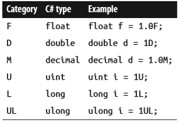
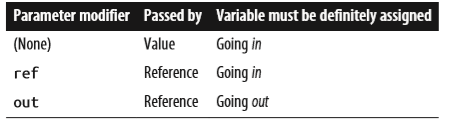

# C# in a nutshell - Language features

## digit separators

- int million = 1_000_000;
- var b = 0b1010_1011_1100_1101_1110_1111;

## Using reserved words

If you really want to use an identifier that clashes with a reserved keyword, you can do so by qualifying it with the @ prefix. For instance:

- class class  {...} // Illegal
- class @class {...} // Legal

The @ symbol doesn’t form part of the identifier itself. So @myVariable is the same as myVariable. The @ prefix can be useful when consuming libraries written in other .NET languages that have different keywords.

## Type Basics

- A variable denotes a storage location that can contain different values over time
- A type defines the blueprint for a value
- All values in C# are instances of a type
- Predefined types are types that are specially supported by the compiler, such as int, double, string, etc.

## Instance versus static members

- The data members and function members that operate on the instance of the type are called instance members
  - By default, members are instance members
- Data members and function members that don’t operate on the instance of the type, but rather on the type itself, must be marked as static
  - Console.WriteLine method is an example of a static method
  - The Console class is actually a static class, which means all its members are static
  - You never actually create instances of a Console—one console is shared across the whole application

## Value Types Versus Reference Types

- Value types comprise most built-in types (specifically, all numeric types, the char type, and the bool type) as well as custom struct and enum types.
  - content is simply a value
  - The assignment of a value-type instance always copies the instance
  - Point p2 = p1; // assignment causes copy
- Reference types comprise all class, array, delegate, and interface types. (This includes the predefined string type.)
  - A reference type is more complex than a value type, having two parts: an object and the reference to that object
  - The content of a reference-type variable or constant is a reference to an object that contains the value.
  - Assigning a reference-type variable copies the reference, not the object instance. This allows multiple variables to refer to the same object
  - Point p2 = p1; // Copies p1 reference

The fundamental difference between value types and reference types is how they are handled in memory.

## Numeric Types


### Numeric literals

- hex: 0x7F, 0x3A
- binary: 0b1010, 0b0011
- exponential: 1E06, 1E09

### Numeric suffixes



## Overflow Checking

The __checked__ operator tells the runtime to generate an OverflowException rather than overflowing silently.

- The checked operator affects expressions with the ++, −−, +, − (binary and unary), *, /, and explicit conversion operators between integral types

Example:

```C#
checked         // Checks all expressions
{               // in statement block.
    ...
    c = a * b;
    ...
}
```

You can make arithmetic overflow checking the default for all expressions in a program by compiling with the /checked+ command-line switch (in Visual Studio, go to Advanced Build Settings).  If you then need to disable overflow checking just for specific expressions or statements, you can do so with the __unchecked__ operator.

More info about Overflow checking P. 35 ff.

## Rectangular arrays

Example:  

```C#
int[,] matrix = new int[3,3];
```

A rectangular array can be initialized as follows:

```C#
var matrix = new int[,]
{  
    {0,1,2},
    {3,4,5},
    {6,7,8}
};
```

## Jagged Arrays

Example:  

```C#
int[][] matrix = new int[3][];
```

The inner dimensions aren’t specified in the declaration because, unlike a rectangular array, each inner array can be an arbitrary length. Each inner array is implicitly initialized to null rather than an empty array. __Each inner array must be created manually:__

```C#
for (int i = 0; i < matrix.Length; i++)
{  
    matrix[i] = new int[3];                     // Create inner array
    for (int j = 0; j < matrix[i].Length; j++)
        matrix[i][j] = i * 3 + j;
}
```

A jagged array can be initialized as follows (to create an array identical to the previous example with an additional element at the end):

```C#
var matrix = new int[][]
{  
    new int[] {0,1,2},
    new int[] {3,4,5},  
    new int[] {6,7,8,9}
};
```

## Parameters

You can control how parameters are passed with the ref and out modifiers:



### Passing arguments by value

By default, arguments in C# are passed by value, which is by far the most common case. This means a copy of the value is created when passed to the method:

```C#
class Test {
    static void Foo (int p){
        p = p + 1;                // Increment p by 1
        Console.WriteLine (p);    // Write p to screen  
    }

    static void Main(){
        int x = 8;
        Foo (x);                  // Make a copy of x
        Console.WriteLine (x);    // x will still be 8  
    }
}
```

Passing a reference-type argument by value copies the reference, but not the object. In the following example, Foo sees the same StringBuilder object that Main instantiated, but has an independent reference to it. In other words, sb and fooSB are separate variables that reference the same StringBuilder object.

### The ref modifier

To pass by reference, C# provides the ref parameter modifier. In the following example, p and x refer to the same memory locations:

```C#
class Test {  
    static void Foo (ref int p)  {
        p = p + 1;               // Increment p by 1
        Console.WriteLine (p);   // Write p to screen
    }
  
    static void Main() {
        int x = 8;
        Foo (ref  x);            // Ask Foo to deal directly with x
        Console.WriteLine (x);   // x is now 9  
    }
}
```

Now assigning p a new value changes the contents of x. Notice how the ref modifier is required both when writing and when calling the method, this makes it very clear what’s going on. The ref modifier is essential in implementing a swap method (later, in “Generics” on page 122 in Chapter 3).

### The out modifier

An out argument is like a ref argument, except it:

- Need not be assigned before going into the function
- Must be assigned before it comes out of the function

The out modifier is most commonly used to get multiple return values back from a method.

```C#
class Test {  
    static void Split (string name, out string firstNames, out string lastName){
        int i = name.LastIndexOf (' ');
        firstNames = name.Substring (0, i);
        lastName   = name.Substring (i + 1);
    }
  
    static void Main() {
    Split ("Stevie Ray Vaughan", out string a, out string b);
    Console.WriteLine (a);         // Stevie Ray
    Console.WriteLine (b);         // Vaughan  
    }
}
```

Like a ref parameter, an out parameter is passed by reference. From C# 7, you can declare variables on the fly when calling methods with out parameters.

When calling methods with multiple out parameters, sometimes you’re not interested in receiving values from all the parameters. In such cases, you can “discard” the ones you’re uninterested in with an underscore:

```C#
Split ("Stevie Ray Vaughan", out string a, out _);   // Discard the 2nd param
Console.WriteLine (a);
```

In this case, the compiler treats the underscore as a special symbol, called a discard. You can include multiple discards in a single call. Assuming SomeBigMethod has been defined with seven out parameters, we can ignore all but the fourth as follows:

```C#
SomeBigMethod (out _, out _, out _, out int x, out _, out _, out _);
```

### The params modifier

The params parameter modifier may be specified on the last parameter of a method so that the method accepts any number of arguments of a particular type. The parameter type must be declared as an array.

Example:

```C#
class Test {  
    static int Sum (params int[] ints)  {
        int sum = 0;
        for (int i = 0; i < ints.Length; i++)
            sum += ints[i];                       // Increase sum by ints[i]
        return sum;
    }
  
    static void Main()  {
        int total = Sum (1, 2, 3, 4);
        Console.WriteLine (total);              // 10  
    }
}
```

You can also supply a params argument as an ordinary array. The first line in Main is semantically equivalent to this:

```C#
int total = Sum (new int[] { 1, 2, 3, 4 } );
```

## Ref locals (C# 7)

C# 7 adds an esoteric feature, whereby you can define a local variable that references an element in an array or field in an object:

```C#
int[] numbers = { 0, 1, 2, 3, 4 };
ref int numRef = ref numbers [2];
```

In this example, numRef is a reference to the numbers[2]. When we modify numRef, we modify the array element:

```C#
numRef *= 10;
Console.WriteLine (numRef);        // 20
Console.WriteLine (numbers [2]);   // 20
```

The target for a ref local must be an array element, field, or local variable; it cannot be a property.

## Ref Returns (C# 7)

You can return a ref local from a method. This is called a ref return:

```C#
static string X = "Old Value";
static ref string GetX() => ref X;    // This method returns a ref

static void Main() {  
    ref string xRef = ref GetX();       // Assign result to a ref local
    xRef = "New Value";
    Console.WriteLine (X);              // New Value
}
```

## null coalescing operator and the null-conditional operator

### Null Coalescing Operator

The ?? operator is the null coalescing operator. It says “If the operand is non-null, give it to me; otherwise, give me a default value.” For example:

```C#
string s1 = null;
string s2 = s1 ?? "nothing";   // s2 evaluates to "nothing" 
```

If the lefthand expression is non-null, the righthand expression is never evaluated. The null coalescing operator also works with nullable value types (see “Nullable Types” on page 173 in Chapter 4).

### Null-conditional Operator (C# 6)

The ?. operator is the null-conditional or “Elvis” operator (after the Elvis emoticon), and is new to C# 6. It allows you to call methods and access members just like the standard dot operator, except that if the operand on the left is null, the expression evaluates to null instead of throwing a NullReferenceException:

```C#
System.Text.StringBuilder sb = null;
string s = sb?.ToString();  // No error; s instead evaluates to null
```

The last line is equivalent to:

```C#
string s = (sb == null ? null : sb.ToString());
```

Upon encountering a null, the Elvis operator short-circuits the remainder of the expression.

||||||||||||||||||||||||||| INSERT MISSING PART |||||||||||||||||||||||||||  
||||||||||||||||||||||||||| INSERT MISSING PART |||||||||||||||||||||||||||  
||||||||||||||||||||||||||| INSERT MISSING PART |||||||||||||||||||||||||||  
||||||||||||||||||||||||||| INSERT MISSING PART |||||||||||||||||||||||||||  

## Generics

C# has two separate mechanisms for writing code that is reusable across different types: inheritance and generics.  Whereas inheritance expresses reusability with a base type, __generics express reusability with a “template” that contains “placeholder” types.__ (C# generics and C++ templates are similar concepts, but they work differently. We explain this difference in “C# Generics Versus C++ Templates” on page 134.)

Generics, when compared to inheritance, can increase type safety and reduce casting and boxing.

### Generic Types

A generic type declares type parameters—placeholder types to be filled in by the consumer of the generic type, which supplies the type arguments.

Here is a generic type Stack\<T>, designed to stack instances of type T. Stack<T> declares a single type parameter T:

```C#
public class Stack<T>
{  
    int position;  
    T[] data = new T[100];  
    public void Push (T obj)  => data[position++] = obj;  
    public T Pop()            => data[--position];
}
```

We can use Stack\<T> as follows:

```C#
var stack = new Stack<int>();
stack.Push (5);
stack.Push (10);
int x = stack.Pop();    // x is 10 int
y = stack.Pop();        // y is 5
```

Stack\<int> fills in the type parameter T with the type argument int, implicitly creating a type on the fly (the synthesis occurs at runtime). Attempting to push a string onto our Stack\<int> would, however, produce a compile-time error. Stack\<int> effectively has the following definition (substitutions appear in bold, with the class name hashed out to avoid confusion):

```C#
public class ###
{
    int position;
    int[] data = new int[100];
    public void Push (int obj)  => data[position++] = obj;
    public int Pop()            => data[--position];
}
```

__Technically, we say that Stack\<T> is an open type, whereas Stack\<int> is a closed type.__

At runtime, all generic type instances are closed—with the placeholder types filled in. This means that the following statement is illegal:

```C#
var stack = new Stack<T>();   // Illegal: What is T?
```

unless inside a class or method that itself defines T as a type parameter (see page 123).

### Why Generics Exist

Generics exist to write code that is reusable across different types. Suppose we needed a stack of integers, but we didn’t have generic types. One solution would be to hardcode a separate version of the class for every required element type (e.g., IntStack, StringStack, etc.). Clearly, this would cause considerable code duplication. Another solution would be to write a stack that is generalized by using object as the element type:

```C#
public class ObjectStack
{
    int position;
    object[] data = new object[10];
    public void Push (object obj) => data[position++] = obj;
    public object Pop()           => data[--position];
}
```

An ObjectStack, however, wouldn’t work as well as a hardcoded IntStack for specifically stacking integers. Specifically, an ObjectStack would require boxing and downcasting that could not be checked at compile time:

```C#
// Suppose we just want to store integers here:
ObjectStack stack = new ObjectStack();
stack.Push ("s");          // Wrong type, but no error!
int i = (int)stack.Pop();  // Downcast - runtime error
```

What we need is both a general implementation of a stack that works for all element types, and a way to easily specialize that stack to a specific element type for increased type safety and reduced casting and boxing. Generics give us precisely this, by allowing us to parameterize the element type.

Stack\<T> has the benefits of both ObjectStack and IntStack. Like ObjectStack, Stack\<T> is written once to work generally across all types. Like IntStack, Stack\<T> is specialized for a particular type—the beauty is that this type is T, which we substitute on the fly. ObjectStack is functionally equivalent to Stack\<object>.

### Generic Methods

||||||||||||||||||||||||||| INSERT MISSING PART |||||||||||||||||||||||||||  
||||||||||||||||||||||||||| INSERT MISSING PART |||||||||||||||||||||||||||  
||||||||||||||||||||||||||| INSERT MISSING PART |||||||||||||||||||||||||||  
||||||||||||||||||||||||||| INSERT MISSING PART |||||||||||||||||||||||||||  

## Delegates (Delegierter/Abgeordneter/Vertreter)

- A delegate is an object that knows how to call a method.
- A delegate type defines the kind of method that delegate instances can call. Specifically, it defines the method’s return type and its parameter types

```C#
delegate int Transformer (int x);
class Test {
    static void Main() {
        Transformer t = Square;          // Create delegate instance
        int result = t(3);               // Invoke delegate
        Console.WriteLine (result);      // 9
    }

    static int Square (int x) => x * x;
}
```

A delegate instance literally acts as a delegate for the caller: the caller invokes the delegate, and then the delegate calls the target method. This indirection decouples the caller from the target method.

The statement:

```C#
Transformer t = Square;
```

is shorthand for:

```C#
Transformer t = new Transformer (Square);
```

Note: Technically, we are specifying a method group when we refer to Square without brackets or arguments. If the method is overloaded, C# will pick the correct overload based on the signature of the delegate to which it’s being assigned

The expression:

```C#
t(3)
```

is shorhand for:

```C#
t.Invoke(3)
```

Note: A delegate is similar to a callback, a general term that captures constructs such as C function pointers.

### Writing Plug-in Methods with Delegates

- A delegate variable is assigned a method at runtime
- This is useful for writing plugin methods

In this example, we have a utility method named Transform that applies a transform to each element in an integer array. The Transform method has a delegate parameter, for specifying a plug-in transform:

```C#
public delegate int Transformer (int x);
class Util {
    public static void Transform (int[] values, Transformer t)
    {
        for (int i = 0; i < values.Length; i++)
        values[i] = t (values[i]);
    }
}
class Test
{
    static void Main()
    {
        int[] values = { 1, 2, 3 };
        Util.Transform (values, Square);      // Hook in the Square method
        foreach (int i in values)
            Console.Write (i + "  ");           // 1   4   9
    }

  static int Square (int x) => x * x;
}
```

Our Transform method is a higher-order function, because it’s a function that takes a function as an argument. (A method that returns a delegate would also be a higher-order function). This concept/term also exists in other languages like Javascript.

### Multicast Delegates

- __All delegate instances have multicast capability. This means that a delegate instance can reference not just a single target method, but also a list of target methods__
- The + and += operators combine delegate instances. For example:

```C#
SomeDelegate d = SomeMethod1;
d += SomeMethod2;
```

- __Invoking d will now call both SomeMethod1 and SomeMethod2. Delegates are invoked in the order they are added.__
- The - and -= operators remove the right delegate operand from the left delegate operand. For example:

```C#
d -= SomeMethod1;
```

- Invoking d will now cause only SomeMethod2 to be invoked.  
- Calling + or += on a delegate variable with a null value works, and it is equivalent to assigning the variable to a new value:

```C#
SomeDelegate d = null;
d += SomeMethod1;       // Equivalent (when d is null) to d = SomeMethod1;
```

- Similarly, calling -= on a delegate variable with a single target is equivalent to assigning null to that variable.

Note: Delegates are immutable, so when you call += or -=, you’re in fact creating a new delegate instance and assigning it to the existing variable.

If a multicast delegate has a nonvoid return type, the caller receives the return value from the last method to be invoked. The preceding methods are still called, but their return values are discarded. In most scenarios in which multicast delegates are used, they have void return types, so this subtlety does not arise.

### Multicast delegate example

Suppose you wrote a method that took a long time to execute. That method could regularly report progress to its caller by invoking a delegate. In this example, the HardWork method has a ProgressReporter delegate parameter, which it invokes to indicate progress:

```C#
public delegate void ProgressReporter (int percentComplete);
public class Util
{
    public static void HardWork (ProgressReporter p)
    {
        for (int i = 0; i < 10; i++)
        {
            p (i * 10);                           // Invoke delegate
            System.Threading.Thread.Sleep (100);  // Simulate hard work
        }
    }
}
```

To monitor progress, the Main method creates a multicast delegate instance p, such that progress is monitored by two independent methods:

```C#
class Test
{
    static void Main()
    {
        ProgressReporter p = WriteProgressToConsole;
        p += WriteProgressToFile;
        Util.HardWork (p);
    }
  
    static void WriteProgressToConsole (int percentComplete) => Console.WriteLine (percentComplete);
    static void WriteProgressToFile (int percentComplete) => System.IO.File.WriteAllText ("progress.txt", percentComplete.ToString());
}
```

### Instance Versus Static Method Targets

__When an instance method is assigned to a delegate object, the latter must maintain a reference not only to the method, but also to the instance to which the method belongs.__ The System.Delegate class’s Target property represents this instance (and will be null for a delegate referencing a static method). For example:

```C#
public delegate void ProgressReporter (int percentComplete);
class Test
{
    static void Main()
    {
        X x = new X();
        ProgressReporter p = x.InstanceProgress;
        p(99);                                 // 99
        Console.WriteLine (p.Target == x);     // True
        Console.WriteLine (p.Method);          // Void InstanceProgress(Int32)
    }
}

class X
{
    public void InstanceProgress (int percentComplete)    => Console.WriteLine (percentComplete);
}
```

### Generic Delegate Types

A delegate type may contain generic type parameters. For example:

```C#
public delegate T Transformer<T> (T arg);
```

With this definition, we can write a generalized Transform utility method that works on any type:

```C#
public class Util
{
    public static void Transform<T> (T[] values, Transformer<T> t)
    {
        for (int i = 0; i < values.Length; i++)
            values[i] = t (values[i]);
    }
}

class Test {
    static void Main()
    {
        int[] values = { 1, 2, 3 };
        Util.Transform (values, Square);      // Hook in Square

        foreach (int i in values)
            Console.Write (i + "  ");           // 1   4   9  
    }
  
    static int Square (int x) => x * x;
}
```

### The Func and Action Delegates

With generic delegates, it becomes possible to write a small set of delegate types that are so general they can work for methods of any return type and any (reasonable) number of arguments. __These delegates are the Func and Action delegates, defined in the System namespace (the in and out annotations indicate variance, which we will cover shortly):__

```C#
delegate TResult Func <out TResult>                ();
delegate TResult Func <in T, out TResult>          (T arg);
delegate TResult Func <in T1, in T2, out TResult>  (T1 arg1, T2 arg2);
... and so on, up to T16

delegate void Action                 ();
delegate void Action <in T>          (T arg);
delegate void Action <in T1, in T2>  (T1 arg1, T2 arg2);
... and so on, up to T16
```

- These delegates are extremely general
- The Transformer delegate in our previous example can be replaced with a Func delegate that takes a single argument of type T and returns a same-typed value:

```C#
public static void Transform<T> (T[] values, Func<T,T> transformer)
{
    for (int i = 0; i < values.Length; i++)
        values[i] = transformer (values[i]);
}
```

The only practical scenarios not covered by these delegates are ref/out and pointer parameters.

### Delegates vs Interfaces

- A problem that can be solved with a delegate can also be solved with an interface.
- For instance, we can rewrite our original example with an interface called ITrans former instead of a delegate:

```C#
public interface ITransformer
{
    int Transform (int x);
}

public class Util
{
    public static void TransformAll (int[] values, ITransformer t)
    {
        for (int i = 0; i < values.Length; i++)
            values[i] = t.Transform (values[i]);
    }
}

class Squarer : ITransformer
{
    public int Transform (int x) => x * x;
}
...

static void Main()
{
    int[] values = { 1, 2, 3 };
    Util.TransformAll (values, new Squarer());

    foreach (int i in values)
    Console.WriteLine (i);
}
```

A delegate design may be a better choice than an interface design if one or more of these conditions are true:

- The interface defines only a single method
- Multicast capability is needed
- The subscriber needs to implement the interface multiple times

However, the interface defines only a single method. Furthermore, our subscriber may need to implement ITransformer multiple times, to support different transforms, such as square or cube. With interfaces, we’re forced into writing a separate type per transform, since Test can implement ITransformer only once. This is quite cumbersome:

```C#
class Squarer : ITransformer
{
    public int Transform (int x) => x * x;
}

class Cuber : ITransformer
{
    public int Transform (int x) => x * x * x;
}
...

static void Main()
{
    int[] values = { 1, 2, 3 };
    Util.TransformAll (values, new Cuber());
    foreach (int i in values)
        Console.WriteLine (i);
}

```

### Delegate Compatibility

#### Type compatibility

Delegate types are all incompatible with one another, even if their signatures are the same:

```C#
delegate void D1();
delegate void D2();
...

D1 d1 = Method1;
D2 d2 = d1;                           // Compile-time error
```

Delegate instances are considered equal if they have the same method targets:

```C#
delegate void D();
...

D d1 = Method1;
D d2 = Method1;
Console.WriteLine (d1 == d2);         // True
```

Multicast delegates are considered equal if they reference the same methods in the same order.

#### Parameter compatibility

When you call a method, you can supply arguments that have more specific types than the parameters of that method. This is ordinary polymorphic behavior. For exactly the same reason, a delegate can have more specific parameter types than its method target. This is called __contravariance__:

```C#
delegate void StringAction (string s);

class Test
{
    static void Main()
    {
        StringAction sa = new StringAction (ActOnObject);
        sa ("hello");
    }

    static void ActOnObject (object o) => Console.WriteLine (o);   // hello
}
```

A delegate merely calls a method on someone else’s behalf. In this case, the String Action is invoked with an argument of type string. When the argument is then relayed to the target method, the argument gets implicitly upcast to an object.

#### Return type compatibility

- If you call a method, you may get back a type that is more specific than what you asked for
- This is ordinary polymorphic behavior
- For exactly the same reason, a delegate’s target method may return a more specific type than described by the delegate
- This is called __covariance__

```C#
delegate object ObjectRetriever();

class Test
{
    static void Main()
    {
        ObjectRetriever o = new ObjectRetriever (RetrieveString);
        object result = o();
        Console.WriteLine (result);      // hello
    }

    static string RetrieveString() => "hello";
}
```

ObjectRetriever expects to get back an object, but an object subclass will also do: delegate return types are covariant.

#### Generic delegate type parameter variance

If you’re defining a generic delegate type, it’s good practice to:

- Mark a type parameter used only on the return value as covariant (out)
- Mark any type parameters used only on parameters as contravariant (in)

Doing so allows conversions to work naturally by respecting inheritance relationships between types.

The following delegate (defined in the System namespace) has a covariant TResult:

```C#
delegate TResult Func\<out TResult>();
```

allowing:

```C#
Func<string> x = ...;
Func<object> y = x;
```

The following delegate (defined in the System namespace) has a contravariant T:

```C#
delegate void Action<in T> (T arg);
```

allowing:

```C#
Action<object> x = ...;
Action<string> y = x;
```

||||||||||||||||||||||||||| INSERT MISSING PART |||||||||||||||||||||||||||  
||||||||||||||||||||||||||| INSERT MISSING PART |||||||||||||||||||||||||||  
||||||||||||||||||||||||||| INSERT MISSING PART |||||||||||||||||||||||||||  
||||||||||||||||||||||||||| INSERT MISSING PART |||||||||||||||||||||||||||

## Concurrency and Asynchrony

The most common concurrency scenarios are:

Writing a responsive user interface:  
In WPF, mobile, and Windows Forms applications, you must run timeconsuming tasks concurrently with the code that runs your user interface to maintain responsiveness.

Allowing requests to process simultaneously:

On a server, client requests can arrive concurrently and so must be handled in parallel to maintain scalability. If you use ASP.NET, WCF, or Web Services, the .NET Framework does this for you automatically. However, you still need to be aware of shared state (for instance, the effect of using static variables for caching).

Parallel programming:

Code that performs intensive calculations can execute faster on multicore/ multiprocessor computers if the workload is divided between cores (Chapter 23 is dedicated to this).

Speculative execution:

On multicore machines, you can sometimes improve performance by predicting something that might need to be done, and then doing it ahead of time. LINQPad uses this technique to speed up the creation of new queries. A variation is to run a number of different algorithms in parallel that all solve the same task. Whichever one finishes first “wins”—this is effective when you can’t know ahead of time which algorithm will execute fastest.

The general mechanism by which a program can simultaneously execute code is called multithreading.  Multithreading is supported by both the CLR and operating system, and is a fundamental concept in concurrency. Understanding the basics of threading, and in particular, the effects of threads on shared state, is therefore essential.

### Threading

A thread is an execution path that can proceed independently of others.

- Each thread runs within an operating system process, which provides an isolated environment in which a program runs
- With a single-threaded program, just one thread runs in the process’s isolated environment and so that thread has exclusive access to it
- With a multithreaded program, multiple threads run in a single process, sharing the same execution environment (memory, in particular)
- This, in part, is why multithreading is useful: one thread can fetch data in the background, for instance, while another thread displays the data as it arrives
  - This data is referred to as shared state

#### Creating a Thread

- A client program (Console, WPF, UWP, or Windows Forms) starts in a single thread that’s created automatically by the operating system (the “main” thread)
- Here it lives out its life as a single-threaded application, unless you do otherwise, by creating more threads (directly or indirectly)
  - The CLR creates other threads behind the scenes for garbage collection and finalization.
- You can create and start a new thread by instantiating a Thread object and calling its Start method
- The simplest constructor for Thread takes a ThreadStart delegate: a parameterless method indicating where execution should begin. For example:

```C#
// NB: All samples in this chapter assume the following namespace imports: using System; using System.Threading;
using System;
using System.Threading;

class ThreadTest {  
    static void Main()  {
        Thread t = new Thread (WriteY);          // Kick off a new thread
        t.Start();                               // running WriteY()

        // Simultaneously, do something on the main thread.
        for (int i = 0; i < 1000; i++) Console.Write ("x");  
    }

  static void WriteY()  {
      for (int i = 0; i < 1000; i++) Console.Write ("y");  
    }
}

// Typical Output: xxxxxxxxxxxxxxxxyyyyyyyyyyyyyyyyyyyyyyyyyyyyyyyyyyyyy xxxxxxxxxxxxxxxxxxxxxxxxxxxxxxxxxxxxxxxxyyyyyyyyyyyyy yyyyyyyyyyyyyyyyyyyyyyyyyyyyyyyxxxxxxxxxxxxxxxxxxxxxx xxxxxxxxxxxxxxxxxxxxxxyyyyyyyyyyyyyyyyyyyyyyyyyyyyyyy yyyyyyyyyyyyyxxxxxxxxxxxxxxxxxxxxxxxxxxxxxxxxxxxxxxxx ...
```

- The main thread creates a new thread t on which it runs a method that repeatedly prints the character y
- Simultaneously, the main thread repeatedly prints the character x
- On a single-core computer, the operating system must allocate “slices” of time to each thread (typically 20 ms in Windows) to simulate concurrency, resulting in repeated blocks of x and y
- __On a multicore or multiprocessor machine, the two threads can genuinely execute in parallel (subject to competition by other active processes on the computer), although you still get repeated blocks of x and y in this example because of subtleties in the mechanism by which Console handles concurrent requests__

Note: A thread is said to be preempted at the points where its execution is interspersed with the execution of code on another thread. The term often crops up in explaining why something has gone wrong!

- __Once started, a thread’s IsAlive property returns true, until the point where the thread ends__
- A thread ends when the delegate passed to the Thread’s constructor finishes executing. Once ended, a thread cannot restart
- Each thread has a Name property that you can set for the benefit of debugging
  - __This is particularly useful in Visual Studio, since the thread’s name is displayed in the Threads Window and Debug Location toolbar__
  - You can set a thread’s name just once; attempts to change it later will throw an exception

The static Thread.CurrentThread property gives you the currently executing thread:

```C#
Console.WriteLine (Thread.CurrentThread.Name);
```

### Join and Sleep

You can wait for another thread to end by calling its __Join method__:

```C#
static void Main()
{
    Thread t = new Thread (Go);
    t.Start();
    t.Join();
    Console.WriteLine ("Thread t has ended!");
}

static void Go()
{
    for (int i = 0; i < 1000; i++)
        Console.Write ("y");
}
```

This prints “y” 1,000 times, followed by “Thread t has ended!” immediately afterward. You can include a timeout when calling Join, either in milliseconds or as a TimeSpan. It then returns true if the thread ended or false if it timed out.

__Thread.Sleep__ pauses the current thread for a specified period:

```C#
Thread.Sleep (TimeSpan.FromHours (1));  // Sleep for 1 hour
Thread.Sleep (500);                     // Sleep for 500 milliseconds
```

Thread.Sleep(0) relinquishes the thread’s current time slice immediately, voluntarily handing over the CPU to other threads. Thread.Yield() does the same thing —except that it relinquishes only to threads running on the same processor.

Note: Sleep(0) or Yield is occasionally useful in production code for advanced performance tweaks. It’s also an excellent diagnostic tool for helping to uncover thread safety issues: if inserting Thread.Yield() anywhere in your code breaks the program, you almost certainly have a bug.

While waiting on a Sleep or Join, a thread is blocked!

### Blocking

- A thread is deemed blocked when its execution is paused for some reason, such as when Sleeping or waiting for another to end via Join
- A blocked thread immediately yields its processor time slice, and from then on consumes no processor time until its blocking condition is satisfied
- You can test for a thread being blocked via its ThreadState property:

```C#
bool blocked = (someThread.ThreadState & ThreadState.WaitSleepJoin) != 0;
```

Note: The ThreadState property is useful for diagnostic purposes, but unsuitable for synchronization, because a thread’s state may change in between testing ThreadState and acting on that information.

When a thread blocks or unblocks, the operating system performs a context switch. This incurs a small overhead, typically one or two microseconds.

### I/O-bound versus compute-bound

- An operation that spends most of its time waiting for something to happen is called I/O-bound—an example is downloading a web page or calling Console.ReadLine (I/O-bound operations typically involve input or output, but this is not a hard requirement: Thread.Sleep is also deemed I/O-bound.)
- In contrast, an operation that spends most of its time performing CPU-intensive work is called computebound

### Blocking versus spinning

An I/O-bound operation works in one of two ways: it either waits synchronously on the current thread until the operation is complete (such as Console.ReadLine, Thread.Sleep, or Thread.Join), or operates asynchronously, firing a callback when the operation finishes some time later.

I/O-bound operations that wait synchronously spend most of their time blocking a thread. They may also “spin” in a loop periodically:

```C#
while (DateTime.Now < nextStartTime)
    Thread.Sleep (100);
```

Leaving aside that there are better ways to do this (such as timers or signaling constructs), another option is that a thread may spin continuously:

```C#
while (DateTime.Now < nextStartTime);
```

In general, this is very wasteful on processor time: as far as the CLR and operating system are concerned, the thread is performing an important calculation, and so gets allocated resources accordingly. In effect, we’ve turned what should be an I/Obound operation into a compute-bound operation.

Note: spinning very briefly can be effective when you expect a condition to be satisfied soon (perhaps within a few microseconds) because it avoids the overhead and latency of a context switch. The .NET Framework provides special methods and classes to assist—see “SpinLock and SpinWait” in [Threading](http://albahari.com/threading/).

Note: Blocking does not incur a zero cost. This is because each thread ties up around 1 MB of memory for as long as it lives and causes an ongoing administrative overhead for the CLR and operating system. For this reason, blocking can be troublesome in the context of heavily I/O-bound programs that need to handle hundreds or thousands of concurrent operations. Instead, such programs need to use a callbackbased approach, rescinding their thread entirely while waiting. This is (in part) the purpose of the asynchronous patterns that we’ll discuss later.

### Local Versus Shared State

- The CLR assigns each thread its own memory stack so that local variables are kept separate
- In the next example, we define a method with a local variable, then call the method simultaneously on the main thread and a newly created thread:

```C#
static void Main() 
{
    new Thread (Go).Start();      // Call Go() on a new thread
    Go();                         // Call Go() on the main thread
}

static void Go()
{  
    // Declare and use a local variable - 'cycles'
    for (int cycles = 0; cycles < 5; cycles++)
    Console.Write ('?');
}
```

A separate copy of the cycles variable is created on each thread’s memory stack, and so the output is, predictably, ten question marks.

__Threads share data if they have a common reference to the same object instance:__

```C#
class ThreadTest
{
    bool _done;
    static void Main()
    {
        ThreadTest tt = new ThreadTest();   // Create a common instance 
        new Thread (tt.Go).Start();
        tt.Go();
    }

    void Go()   // Note that this is an instance method
    {
        if (!_done)
        {
            _done = true;
            Console.WriteLine ("Done");
        }
    }
}
```

Because both threads call Go() on the same ThreadTest instance, they share the _done field. This results in “Done” being printed once instead of twice.

__Local variables captured by a lambda expression or anonymous delegate are converted by the compiler into fields, and so can also be shared:__

```C#
class ThreadTest {
    static void Main()
    {
        bool done = false;
        ThreadStart action = () =>
        {
            if (!done)
            {
                done = true; Console.WriteLine ("Done");
            }
        };

    new Thread (action).Start();
    action();
    }
}
```

Static fields offer another way to share data between threads:

```C#
class ThreadTest {
    static bool _done;    // Static fields are shared between all threads in the same application domain.

    static void Main()
    {
        new Thread (Go).Start();
        Go();
    }

    static void Go()  
    {
        if (!_done)
        {
            _done = true;
            Console.WriteLine ("Done");  
        }
    }
}
```

All three examples illustrate another key concept: that of thread safety (or rather, lack of it!). The output is actually indeterminate: it’s possible (though unlikely) that “Done” could be printed twice. If, however, we swap the order of statements in the Go method, the odds of “Done” being printed twice go up dramatically:

```C#
static void Go()
{
    if (!_done)
    {
        Console.WriteLine ("Done");
        _done = true;
    }
}
```

The problem is that one thread can be evaluating the if statement right as the other thread is executing the WriteLine statement—before it’s had a chance to set done to true.

### Locking and Thread Safety

We can fix the previous example by obtaining an exclusive lock while reading and writing to the shared field. C# provides the lock statement for just this purpose:

```C#
class ThreadSafe
{
    static bool _done;
    static readonly object _locker = new object();

    static void Main()
    {
        new Thread (Go).Start();
        Go();
    }

    static void Go()
    {
        lock (_locker)
        {
            if (!_done)
            {
                Console.WriteLine ("Done");
                _done = true;
            }
        }
    }
}
```

When two threads simultaneously contend a lock (which can be upon any reference-type object, in this case, _locker), one thread waits, or blocks, until the lock becomes available. In this case, it ensures only one thread can enter its code block at a time, and “Done” will be printed just once. Code that’s protected in such a manner—from indeterminacy in a multithreaded context—is called __thread-safe__.

Note: Even the act of autoincrementing a variable is not thread-safe: the expression x++ executes on the underlying processor as distinct read-increment-write operations. So, if two threads execute x++ at once outside a lock, the variable may end up getting incremented once rather than twice (or worse, x could be torn, ending up with a bitwise-mixture of old and new content, under certain conditions).

__Locking is not a silver bullet for thread safety—it’s easy to forget to lock around accessing a field, and locking can create problems of its own (such as deadlocking).__

A good example of when you might use locking is around accessing a shared inmemory cache for frequently accessed database objects in an ASP.NET application. This kind of application is simple to get right, and there’s no chance of deadlocking. We give an example in “Thread Safety in Application Servers” on page 882 in Chapter 22.

### Passing Data to a Thread

Sometimes you’ll want to pass arguments to the thread’s startup method. The easiest way to do this is with a lambda expression that calls the method with the desired arguments:

```C#
static void Main()
{
    Thread t = new Thread ( () => Print ("Hello from t!") );
    t.Start();
}

static void Print (string message) { Console.WriteLine (message); }
```

With this approach, you can pass in any number of arguments to the method. You can even wrap the entire implementation in a multistatement lambda:

```C#
new Thread (() =>
{  
    Console.WriteLine ("I'm running on another thread!");
    Console.WriteLine ("This is so easy!");
}).Start();
```

Lambda expressions didn’t exist prior to C# 3.0. So you might also come across an old-school technique, which is to pass an argument into Thread’s Start method:

```C#
static void Main()
{
    Thread t = new Thread (Print);
    t.Start ("Hello from t!");
}

static void Print (object messageObj)
{
    string message = (string) messageObj;   // We need to cast here
    Console.WriteLine (message);
}
```

This works because Thread’s constructor is overloaded to accept either of two delegates:

```C#
public delegate void ThreadStart();
public delegate void ParameterizedThreadStart (object obj);
```

The limitation of ParameterizedThreadStart is that it accepts only one argument. And because it’s of type object, it usually needs to be cast.

### Lambda expressions and captured variables

As we saw, a lambda expression is the most convenient and powerful way to pass data to a thread. However, you must be careful about accidentally modifying captured variables after starting the thread:

```C#
for (int i = 0; i < 10; i++)
    new Thread (() => Console.Write (i)).Start();
```

The output is nondeterministic! Here’s a typical result: 0223557799

The problem is that the i variable refers to the same memory location throughout the loop’s lifetime! Therefore, each thread calls Console.Write on a variable whose value may change as it is running. The solution is to use a temporary variable as follows:

```C#
for (int i = 0; i < 10; i++)
{
    int temp = i;
    new Thread (() => Console.Write (temp)).Start();
}
```

Each of the digits 0 to 9 is then written exactly once. (The ordering is still undefined because threads may start at indeterminate times.)

### Exception Handling

Any try/catch/finally blocks in effect when a thread is created are of no relevance to the thread when it starts executing. Consider the following program:

```C#
public static void Main(){
    try
    {
        new Thread (Go).Start();
    }
    catch (Exception ex)
    {
        // We'll never get here!
        Console.WriteLine ("Exception!");
    }
}
```

The try/catch statement in this example is ineffective, and the newly created thread will be encumbered with an unhandled NullReferenceException. This behavior makes sense when you consider that each thread has an independent execution path.

The remedy is to move the exception handler into the Go method:

```C#
public static void Main()
{
    new Thread (Go).Start();
}
static void Go()
{
    try
    {
        ...
        throw null;    // The NullReferenceException will get caught below
        ...
    }
    catch (Exception ex)
    {
        Typically log the exception, and/or signal another thread
        that we've come unstuck
        ...
    }
}
```

You need an exception handler on all thread entry methods in production applications—just as you do (usually at a higher level, in the execution stack) on your main thread. An unhandled exception causes the whole application to shut down. With an ugly dialog box!

Note: typically, you’d log the details of the exception, and then perhaps display a dialog box allowing the user to automatically submit those details to your web server. You then might choose to restart the application, because it’s possible that an unexpected exception might leave your program in an invalid state.

### Centralized exception handling

- In WPF, UWP, and Windows Forms applications, you can subscribe to “global” exception handling events, Application.DispatcherUnhandledException and Application.ThreadException, respectively
- These fire after an unhandled exception in any part of your program that’s called via the message loop (this amounts to all code that runs on the main thread while the Application is active)
- This is useful as a backstop for logging and reporting bugs (although it won’t fire for unhandled exceptions on non-UI threads that you create)
- Handling these events prevents the program from shutting down, although you may choose to restart the application to avoid the potential corruption of state that can follow from (or that led to) the unhandled exception

AppDomain.CurrentDomain.UnhandledException fires on any unhandled exception on any thread, but since CLR 2.0, the CLR forces application shutdown after your event handler completes. However, you can prevent shutdown by adding the following to your application configuration file:

```XML
<configuration>
    <runtime>
        <legacyUnhandledExceptionPolicy enabled="1" />
    </runtime>
</configuration>
```

This can be useful in programs that host multiple application domains (Chapter 24): if an unhandled exception occurs in a nondefault application domain, you can destroy and re-create the offending domain rather than restarting the whole application.

### Foreground Versus Background Threads

- __By default, threads you create explicitly are foreground threads__
  - Foreground threads keep the application alive for as long as any one of them is running
  - __background threads do not__
  - Once all foreground threads finish, the application ends, and any background threads still running abruptly terminate
- A thread’s foreground/background status has no relation to its priority (allocation of execution time)

You can query or change a thread’s background status using its IsBackground property:

```C#
static void Main (string[] args)
{
    Thread worker = new Thread ( () => Console.ReadLine() );
    if (args.Length > 0)
        worker.IsBackground = true;
        worker.Start();
}
```

- If this program is called with no arguments, the worker thread assumes foreground status and will wait on the ReadLine statement for the user to press Enter
- if an argument is passed to Main(), the worker is assigned background status, and the program exits almost immediately as the main thread ends (terminating the ReadLine)
- When a process terminates in this manner, any finally blocks in the execution stack of background threads are circumvented
  - If your program employs finally (or using) blocks to perform cleanup work such as deleting temporary files, you can avoid this by explicitly waiting out such background threads upon exiting an application, either by joining the thread, or with a signaling construct (see “Signaling” on page 572)
  - In either case, you should specify a timeout, so you can abandon a renegade thread should it refuse to finish, otherwise your application will fail to close without the user having to enlist help from the Task Manager.
- Foreground threads don’t require this treatment, but you must take care to avoid bugs that could cause the thread not to end
- A common cause for applications failing to exit properly is the presence of active foreground threads

### Thread Priority