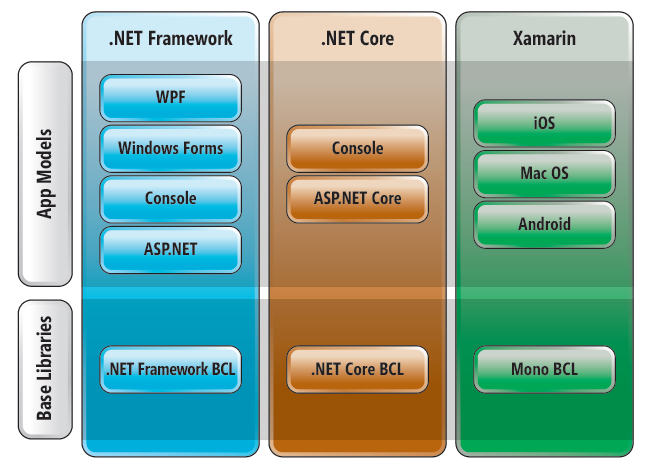
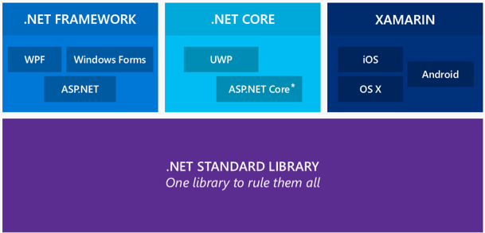

# The difference between .Net Core, .Net Standard and UWP

__.NET Core:__

- This is the latest .NET implementation. It’s open source and available for multiple OSes
- With .NET Core, you can build cross-platform console apps and ASP.NET Core Web applications and cloud services
- Used for building cross-platform console apps and ASP.NET Core Web apps and cloud services

__.NET Standard:__

- This is the set of fundamental APIs (commonly referred to as base class library or BCL) that all .NET implementations must implement
- By targeting .NET Standard, you can build libraries that you can share across all your .NET apps, no matter on which .NET implementation or OS they run
- __Used for building libraries that can be referenced from all .NET implementations, such as .NET Framework, .NET Core and Xamarin__

__.Net Framework:__

- Used for building Windows desktop applications and ASP.NET Web apps running on IIS
- the only framework from the here mentioned that is not open source

