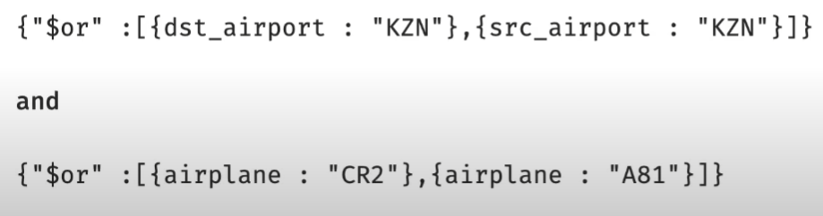

# Advanced CRUD operations

## MQL Operators

### Update Operators

Example: \$inc, \$set, \$unset  
Enable us to modify data in the database.

### $ Operator

The $ operator has multiple uses:

- precedes MQL operators
- precedes aggregation pipeline stages
- allows access to field values

### Query Operators

Provide additional ways to locate data within the database.

#### Comparison Operators

- $eq (==): **Eq**ual to
- $ne (!=): **N**ot **e**qual to
- $gt (>): **G**reater **t**han
- $lt (<): **L**ess **t**han
- $gte (>=): **G**reater **t**han or **e**qual to
- $lte (<=): **L**ess **t**han or **e**qual to

Syntax to use them:

```c
{ <field>: { <operator>: <value> } }

// Example:

{ "tripduration": { "$lte" : 60 } }

// 2 Conditions:

{ "tripduration": { "$lte" : 60 }, "usertype": { "$ne": "Subscriber" } }
```

With mongodb shell we can query like this:

```c
db.trips.find({ "tripduration": { "$lte" : 70 },
                "usertype": { "$eq": "Customer" }}).pretty()

// This is equivalent to (implicit equality operator):

db.trips.find({ "tripduration": { "$lte" : 70 },
                "usertype": "Customer" }).pretty()
```

### Logic Operators

- **$and:** Match all of the specified query clauses
- **$or:** At least one of the query clauses is matched
- **$nor:** Fail to match both given clauses

Syntax:

```c
{ <operator> : [ { statement1 }, { statement2 }, ... ] }
```

- **$not:** Negates the query requirement

Syntax:

```c
{ $not: { statement } }
```

#### $and is the default operator

A query like this:

```c
{ "tripduration": 60, "usertype": "Subscriber" }
```

already contains an implicit $and. The explicit typing looks like this:

```c
{ "$and": [{ "tripduration": 60 }, { "usertype": "Subscriber" }] }
```

Another example:


**Note:** Explicitly use \$and when you need to include the same operator more than once in a query



```c
db.routes.find({ "$and": [ { "$or" :[ { "dst_airport": "KZN" },
                                    { "src_airport": "KZN" } ]
                           },
                          { "$or" :[ { "airplane": "CR2" },
                                     { "airplane": "A81" } ]
                          }
                         ]}).pretty()
```
