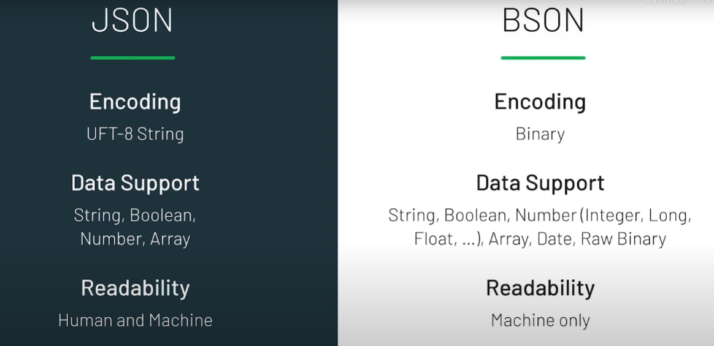

# Documents and Collections

## What is a document?

- A way to organize and store data as a set of field-value pairs
- A document uses the JSON format

```json
{
  "name": "Lakshmi",
  "title": "Team Lead",
  "age": 26
}
```

- Internally MongoDB translates JSON to BSON (Binary JSON) to address shortcomings of JSON:
  - text based ⇒ space consuming
  - supports limited number of basic data types



## The \_id field

- Every document must have a unique `_id` value (unique in the collection it resides in)
- `ObjectId()` us the default value for the `_id` field unless otherwise specified

## What is a collection?

- An organized store of documents in MongoDB, usually with common fields between documents
