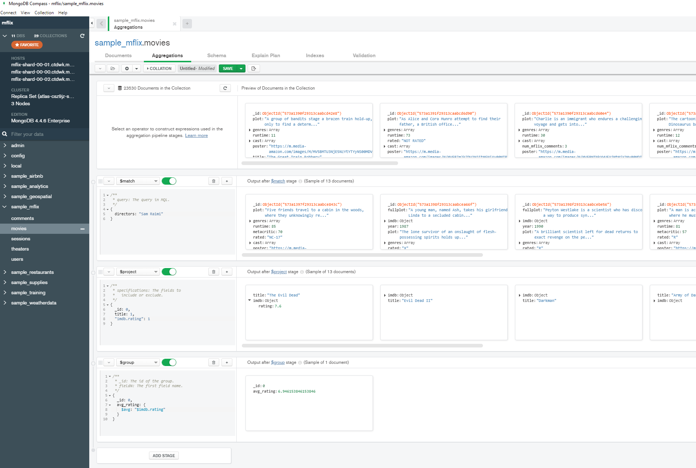

# User-Facing Backend

## Aggregation Pipeline

Example:



Example of a similar (but not the same) pipeline in C#:

```C#
public void CountMovies()
        {
            // This stage finds all movies that have a specific director
            var matchStage = new BsonDocument("$match",
                new BsonDocument("directors", "Rob Reiner"));


            // This stage sorts the results by the number of reviews,
            // in descending order
            var sortStage = new BsonDocument("$sort",
                new BsonDocument("tomatoes.viewer.numReviews", -1));

            // This stage generates the projection we want
            var projectionStage = new BsonDocument("$project",
                new BsonDocument
                    {
                        { "_id", 0 },
                        { "Movie Title", "$title" },
                        { "Year", "$year" },
                        { "Average User Rating", "$tomatoes.viewer.rating" }
                    });

            /* We now put the stages together in a pipeline. Note that a
             * pipeline definition requires us to specify the input and output
             * types. In this case, the input is of type Movie, but because
             * we are using a Projection with custom fields, our output is
             * a generic BsonDocument object. To be really cool, we could
             * create a mapping class for the output type, which is what we've
             * done for you in the MFlix application.
             */
            
            var pipeline = PipelineDefinition<Movie, BsonDocument>
                .Create(new BsonDocument[] {
                    matchStage,
                    sortStage,
                    projectionStage
                });

            
            var result = _moviesCollection.Aggregate(pipeline).ToList();
            /* Note: we're making a synchronous Aggregate() call.
             * If you want a challenge, change the line above to make an
             * asynchronous call (hint: you'll need to make 2 changes),
             * and then confirm the unit test still passes.
             */

            Assert.AreEqual(14, result.Count);
            var firstMovie = result[0];
            Assert.AreEqual("The Princess Bride", firstMovie.GetValue("Movie Title").AsString);
            Assert.AreEqual(1987, firstMovie.GetValue("Year").AsInt32);
            Assert.AreEqual(4.0, firstMovie.GetValue("Average User Rating").AsDouble);

            /* We specifically excluded the "Id" field in the projection stage
             * that we built in the code above, so let's make sure that field
             * wasn't included in the resulting BsonDocument. We expect the call
             * to GetValue() to throw a KeyNotFoundException exception if the
             * field doesn't exist. 
             */

            Assert.Throws<KeyNotFoundException>(()=> firstMovie.GetValue("Id"));
        }
```