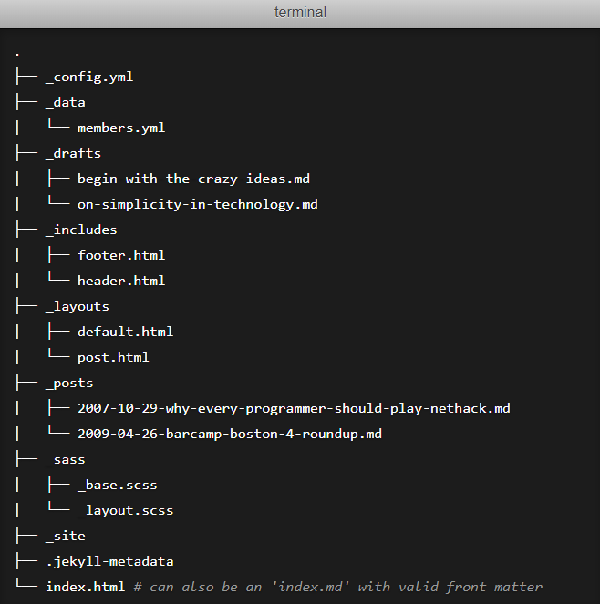
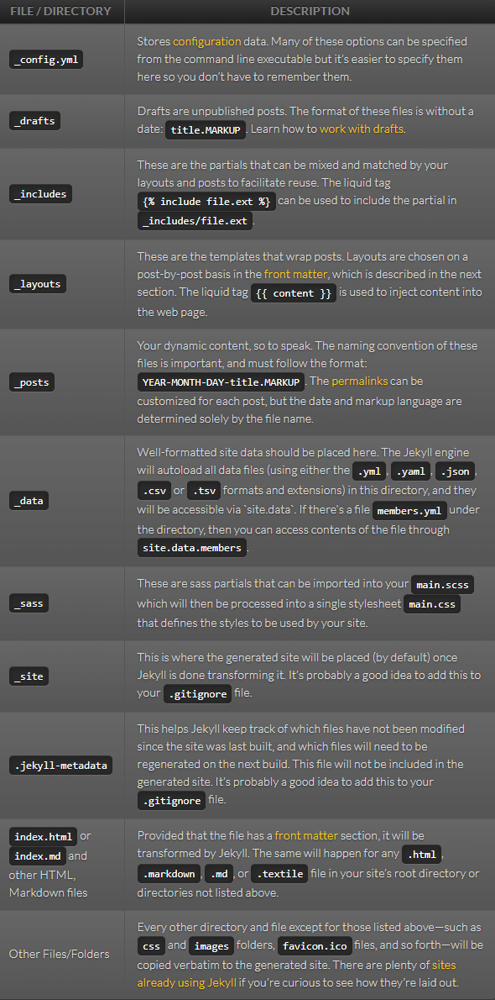
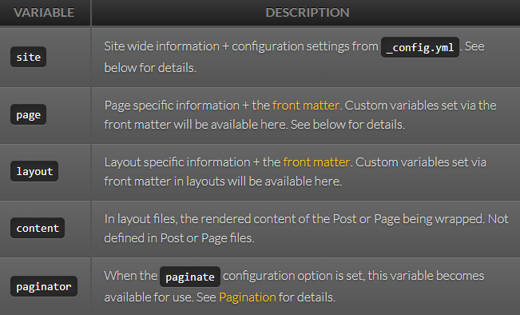
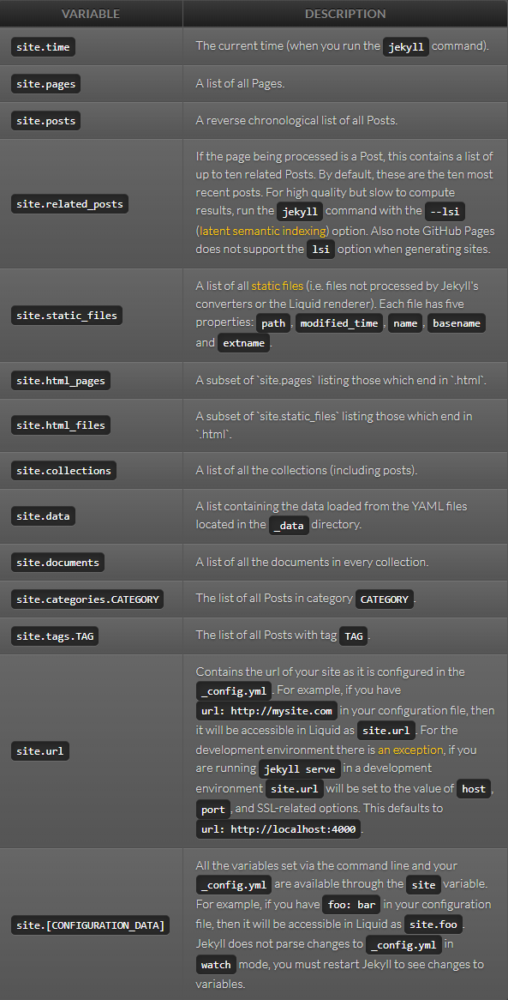
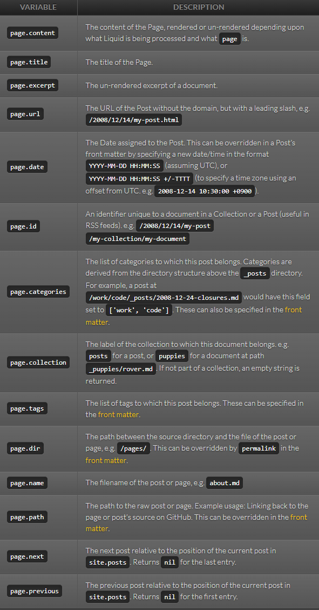
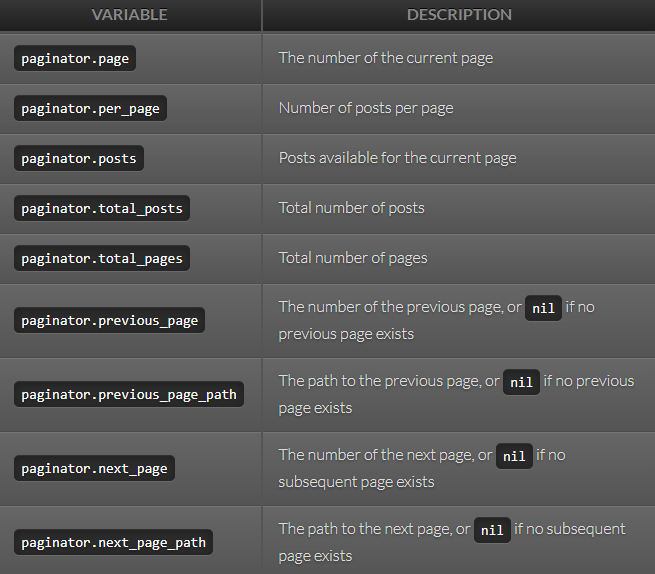

# Notes on Jekyll

Jekyll is a simple, extendable, static site generator. Given text written in a supported markup language it churns through layouts to create a static website. Throughout that process you can tweak how you want the site URLs to look, what data gets displayed in the layout, and more.

## Creating a new project

```CLI
jekyll new <sitename>
```

## Building a site

```CLI
bundle exec jekyll serve
```

## Directory Structure

A basic Jekyll site usually looks something like this:



What each of these does:



## Variables

Jekyll traverses your site looking for files to process. Any files with [front matter](https://jekyllrb.com/docs/front-matter/) are subject to processing. For each of these files, Jekyll makes a variety of data available via the Liquid. The following is a reference of the available data:

### Global Variables



### Site Variables



### Page Variables



Use Custom Front Matter:

Any custom front matter that you specify will be available under ```page```. For example, if you specify ```custom_css: true``` in a page’s front matter, that value will be available as ```page.custom_css```.

If you specify front matter in a ```layout```, access that via layout. For example, if you specify ```class: full_page``` in a layout’s front matter, that value will be available as ```layout.class``` in the layout and its parents.

### Paginator Variables



Paginator variable availability:

These are only available in index files, however they can be located in a subdirectory, such as ```/blog/index.html```.