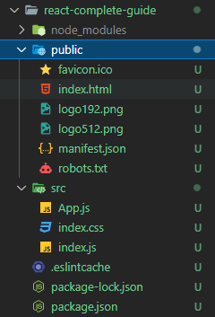

# React Basics

## Creating a new project

To create a new React project we simply use the following command:

```bash
npx create-react-app <app-name>
```

## Structure of a React project

A very basic React project will look something like this:



### index.js

The entry point of our React application.
Looks something like this:

```JSX
import ReactDOM from 'react-dom';

// would not work in plain javascript, there is no import of css files there
import './index.css';
import App from './App';

// the app component gets inserted into the DOM inside the 'root' element
ReactDOM.render(<App />, document.getElementById('root'));
```

### index.html

Imports our React application and defines the root element where the application will be injected.
Looks something like this:

```HTML
<!DOCTYPE html>
<html lang="en">
  <head>
    <meta charset="utf-8" />
    <link rel="icon" href="%PUBLIC_URL%/favicon.ico" />
    <meta name="viewport" content="width=device-width, initial-scale=1" />
    <meta name="theme-color" content="#000000" />
    <meta
      name="description"
      content="Web site created using create-react-app"
    />
    <link rel="apple-touch-icon" href="%PUBLIC_URL%/logo192.png" />
    <link rel="manifest" href="%PUBLIC_URL%/manifest.json" />
    <title>React App</title>
  </head>
  <body>
    <noscript>You need to enable JavaScript to run this app.</noscript>
    <div id="root"></div>
  </body>
</html>
```

### App.js

Our root React component (a function component to be precise). It looks like this:

```JSX
function App() {
  // JSX syntax
  return (
    <div>
      <h2>Let's get started!</h2>
    </div>
  );
}

export default App;
```

## Creating a custom component

A very basic custom component might look like this:

```JSX
function ExpenseItem() {
  return (
    <div>
      <div>Date</div>
      <div>
        <h2>Title</h2>
        <div>Amount</div>
      </div>
    </div>
  );
}

export default ExpenseItem;
```

**Custom components must start with a capital letter** and are usually saved under a folder named 'components' in the project's src folder.

### Applying css to the component

If we want to add css styling to our component we need to import the css file like this:

```JSX
import ExpenseItem from "./components/ExpenseItem";

function App() {
  return (
    // instead of class we should use className here to reference the css classes.
    <div className="expense-item">
    ...
```

### JSX interpolation

Like with many other languages we can use interpolation with JSX.
This may look something like this:

```JSX
function ExpenseItem() {
  const expenseDate = new Date(2021, 2, 28);
  const expenseTitle = "Car Insurance";
  const expenseAmount = 294.67;

  return (
    <div className="expense-item">
      <div>{expenseDate.toISOString()}</div>
      <div className="expense-item__description">
        <h2>{expenseTitle}</h2>
        <div className="expense-item__price">${expenseAmount}</div>
      </div>
    </div>
  );
}
```

### Using props

Props are arguments passed into React components. Props are passed to components via HTML attributes.
This looks like this:

```JSX
// Inside the parent component (App)
function App() {
  const expenses = [
    {
      id: "e1",
      title: "Toilet Paper",
      amount: 94.12,
      date: new Date(2020, 7, 14),
    },
    { id: "e2", title: "New TV", amount: 799.49, date: new Date(2021, 2, 12) },
    {
      id: "e3",
      title: "Car Insurance",
      amount: 294.67,
      date: new Date(2021, 2, 28),
    },
    {
      id: "e4",
      title: "New Desk (Wooden)",
      amount: 450,
      date: new Date(2021, 5, 12),
    },
  ];

  return (
    <div>
      <h2>Let's get started!</h2>
      // passing in the props
      <ExpenseItem
        title={expenses[0].title}
        amount={expenses[0].amount}
        date={expenses[0].date}
      ></ExpenseItem>
      <ExpenseItem
        title={expenses[1].title}
        amount={expenses[1].amount}
        date={expenses[1].date}
      ></ExpenseItem>
      <ExpenseItem
        title={expenses[2].title}
        amount={expenses[2].amount}
        date={expenses[2].date}
      ></ExpenseItem>
      <ExpenseItem
        title={expenses[3].title}
        amount={expenses[3].amount}
        date={expenses[3].date}
      ></ExpenseItem>
    </div>
  );
}

// Inside the component which consumes the props (ExpenseItem)
function ExpenseItem(props) {
  return (
    <div className="expense-item">
      // using the props
      <div>{props.date.toISOString()}</div>
      <div className="expense-item__description">
        <h2>{props.title}</h2>
        <div className="expense-item__price">${props.amount}</div>
      </div>
    </div>
  );
}
```

### Composition and using props.children

Sometimes you might want to have a component where you don't configure everything through props but where instead you're able to **pass content between the opening and closing** tags of that component. This is especially useful for components that represent 'generic boxes' and that don’t know their children ahead of time.

Example:

```JSX
import "./Card.css";

function Card(props) {
  // this component allows us to append css classes through its props
  const classes = "card " + props.className;
  // props.children displays everything between the opening and closing tags of the Card component
  return <div className={classes}>{props.children}</div>;
}

export default Card;

// using Card
<Card className="expenses">
    <ExpenseItem
    title={props.expenses[0].title}
    amount={props.expenses[0].amount}
    date={props.expenses[0].date}
    ></ExpenseItem>
    ...
</Card>
```

### Arrow syntax

We can also write our components with the arrow syntax, which looks like this:

```JSX
const App = () => {
  const expenses = [...];

  return (
    <div>
      <ExpenseList expenses={expenses} />
    </div>
  );
};
```

## React state and working with events

### Events

Attaching events to an element is simple. Take for instance the onclick event:

```JSX
<button onClick={clickHandler}>Change Title</button>
```

### The useState Hook

A Hook is a special function that lets you “hook into” React features. `useState` is a hook that lets you add React state to function components. The `useState` hook is used like this:

```JSX
const ExpenseItem = (props) => {
  // The hook function returns a pair of values, the first of which is the hook's current value,
  // and the second is a function that should be called to update the hook's value.
  const [title, setTitle] = useState(props.title);

  const clickHandler = () => {
    setTitle("Updated!");
  };

  return (
      <div className="expense-item__description">
        <h2>{title}</h2>
        ...
```

### 2 way bindings

If we want to gather input from a form but also want to clear it after the user submitted it, we should use a 2 way binding. This allows us to listen to any changes in the form and clear it after the user submitted it.

Example:

```JSX
...

const submitHandler = (event) => {
    // prevent page reload
    event.preventDefault();
    const expenseData = {
      title: enteredTitle,
      amount: enteredAmount,
      date: new Date(enteredDate),
    };

    // clear input fields after submit (state hook functions)
    setEnteredTitle("");
    setEnteredAmount("");
    setEnteredDate("");
  };

  return (
    <form onSubmit={submitHandler}>
      <div className="new-expense__controls">
        <div className="new-expense__control">
          <label>Title</label>
          <input
            type="text"
            // allows us to clear it after submit
            value={enteredTitle}
            // allows us to listen to changes
            onChange={titleChangeHandler}
          />
        </div>
        <div className="new-expense__control">
          <label>Amount</label>
          <input
            type="number"
            min="0.01"
            step="0.01"
            value={enteredAmount}
            onChange={amountChangeHandler}
          />
        </div>
        <div className="new-expense__control">
          <label>Date</label>
          <input
            type="date"
            min="2019-01-01"
            max="2022-12-31"
            value={enteredDate}
            onChange={dateChangeHandler}
          />
        </div>
      </div>
      <div className="new-expense__actions">
        <button type="submit">Add Expense</button>
      </div>
    </form>
  );

...
```

### Passing data from child to parent

When we want to pass data from a child to a parent, we use props.  
Example:

```JSX
// parent component
const NewExpense = () => {
  // Handles the submission of a new expense.
  // Adds a random id to the expense data.
  const saveExpenseDataHandler = (expenseData) => {
    const expenseData = {
      ...expenseData,
      id: Math.random().toString(),
    };

    console.log("Saving expense data: ", expenseData);
  };

  return (
    <div className="new-expense">
      <ExpenseForm onSaveExpenseData={saveExpenseDataHandler} />
    </div>
  );
};

// child component
const submitHandler = (event) => {
    ...

    const expenseData = {
      title: enteredTitle,
      amount: enteredAmount,
      date: new Date(enteredDate),
    };

    // call the passed down function to handle the newly added expense data
    props.onSaveExpenseData(expenseData);

    ...
  };
```

### Controlled Components

In HTML, form elements such as `<input>`, `<textarea>`, and `<select>` typically maintain their own state and update it based on user input. In React, mutable state is typically kept in the state property of components, and only updated with `setState()`.

We can combine the two by making the React state be the “single source of truth”. Then the **React component that renders a form also controls what happens in that form on subsequent user input**. An input form element whose value is controlled by React in this way is called a “controlled component”.

Example:

```JSX
// Component using the controlled component
const ExpenseList = (props) => {
  const [selectedYear, setSelectedYear] = useState(2020);

  const changeFilterHandler = (year) => {
    setSelectedYear(year);
    console.log(year);
  };

  return (
    <div>
      <Card className="expenses">
        <ExpensesFilter
          selected={selectedYear}
          onChangeFilter={changeFilterHandler}
        />
        ...
      </Card>
    </div>
  );
};

// controlled component ExpensesFilter
const ExpensesFilter = (props) => {
  const dropdownChangeHandler = (event) => {
    props.onChangeFilter(event.target.value);
  };

  return (
    <div className="expenses-filter">
      <div className="expenses-filter__control">
        <label>Filter by year</label>
        <select value={props.selected} onChange={dropdownChangeHandler}>
          <option value="2022">2022</option>
          <option value="2021">2021</option>
          <option value="2020">2020</option>
          <option value="2019">2019</option>
        </select>
      </div>
    </div>
  );
};
```

Since the `value` attribute is set on our `ExpensesFilter` element (through the passed down `selected` prop), the displayed value will always be the state `selectedYear`, making the React state the source of truth. Since `changeFilterHandler` runs on every new selection to update the React state, the year can then be used to filter the expenses.

### Stateful and Stateless components

In React, a stateful component is a component that holds some state. Stateless components, by contrast, have no state. Note that both types of components can use props.

## Rendering Lists & Conditional Content

### Dynamic list elements

To generate the expenses list dynamically we can do this:

```JSX
const ExpenseList = (props) => {
  ...
  // generate one ExpenseItem for each expense that is passed down through props
  return (
    <div>
      <Card className="expenses">
        ...
        {props.expenses.map((expense) => (
          <ExpenseItem
            key={expense.id}
            title={expense.title}
            amount={expense.amount}
            date={expense.date}
          />
        ))}
      </Card>
    </div>
  );
};
```

## Updating the list

To update the list we need state in our App.js file:

```JSX
const dummyExpenses = [
    ...
    { id: "e2", title: "New TV", amount: 799.49, date: new Date(2021, 2, 12) },
    ...
  ];

const App = () => {
  const [expenses, setExpenses] = useState(dummyExpenses);

  const addExpenseHandler = (expense) => {
    // add new expense to current list (this is how we should get the current state instead of
    // accessing expenses directly)
    setExpenses((prevExpenses) => {
      return [expense, ...prevExpenses];
    });
  };

  return (
    <div>
      <ExpenseList expenses={expenses} />
      <NewExpense onAddExpense={addExpenseHandler} />
    </div>
  );
};
```
