# Notes on PennX: SD4x

## Anatomy of an HTTP Request

The first line of a request will always be a verb followed by an argument:

- GET: retrieve resource
- HEAD: retrieve only headers (information about the resource)
- POST: create resource (usually used in form submission context)

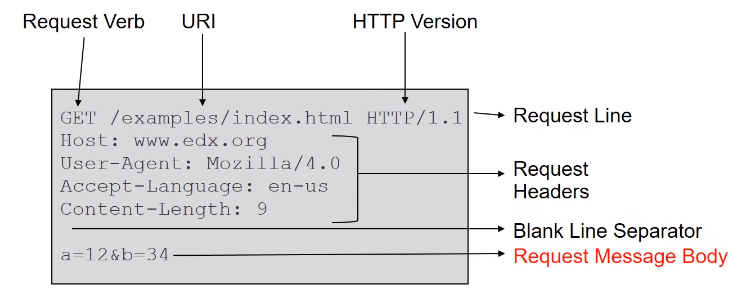

## Anatomy of an HTTP Response

The first line of a response is always the protocol and status code. Following that comes other header information regarding the response and/or the server, then a blank line and the the response body, i.e. the resource that was requested.

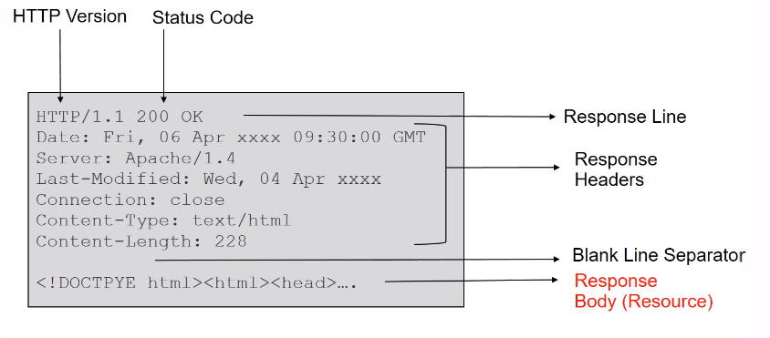

## CSS Syntax

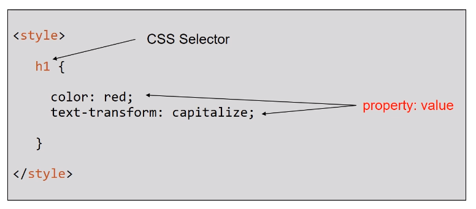

## Javascript

Truthy and falsy values:

- truthy values: 'test', 'false', 5, etc.
- falsy values: null, undefined, 0, NAN, '' (treated as false)

Any variable type can become a boolean when used with logical operators!

## Arrays

Values stored can be of any type:

```Javascript
var myArray = ['cars', 12, false]
```

- When reading an array value by its index, the array will return undefined if the index is out of bounds, __no exception!__
- Elements can be written to negative indices and there can be gaps between elements, where no other element is
  - __e.g. a[1] = 'test', a[3] = 'another test' and a[2] is undefined, a.length will be 2 not 3__

### push()

Adds an element to the end of an array: e.g. myArray.push('wow');

### unshift()

Adds an element to the start of an array: e.g. myArray.unshift('wow');

### pop()

Removes and returns an element from the end of the array: e.g. var vehicle = myArray.pop();

### shift()

Removes and returns an element from the beginning of the array: e.g. var vehicle = myArray.shift();

## Objects

- Objects are used to store key-value pairs
- values can be of any type, including objects
- values can be accessed by myObject.property or myObject['property']

Example object declaration and modification:

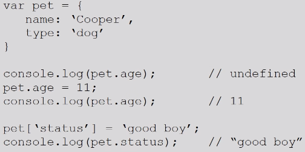

key-value pair age and status is added since it doesn't exist yet.

## Control Structures

Keep in mind difference between comparisons "==" and "===":  
== will compare different types and do conversions (1 == '1': true!)  
== will do no conversions, simple comparison (1 === '1': false!)

Objects are only considered equal if the variables are aliases, i.e. refer to the same object:

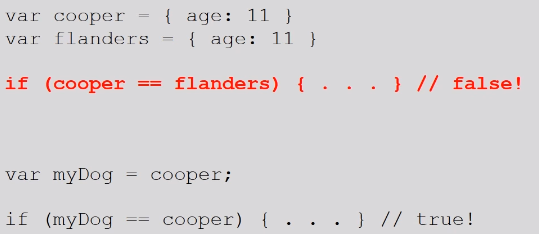

## Functions

Example of a function:

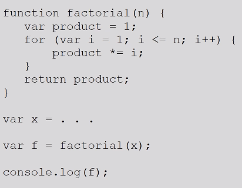

Array has predefined functions like:

- forEach, which executes a function for each element of the array (like linq).
- every, which evaluates each element against a function that returns either true or false (an int and a string can also be truthy so not literally true or false)
- map, applies a function to every element of the array and saves the result for each element in a new array

### Pass by value vs Pass by reference

Primitive arguments are passed by value, the function cannot change them.
Object arguments are passed by reference, the function can change them.

### Functions as objects

__Javascript functions are objects!__  
Therefore functions can take advantage of the benefits of an object, such as having properties

Since JavaScript functions are objects, they can be assigned to variables:

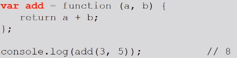

JavaScript functions can also be declared and used in objects:

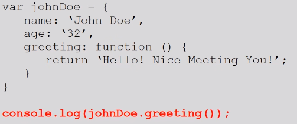

### Object prototypes

- Every object in JavaScript has a prototype, accessed from the \_\_proto__ property in the object.
- The \_\_proto__ property is also an object, with its own \_\_proto__ property, and so on
- The root prototype of all objects is Object.prototype
- An object inherits the properties of its prototype

### Creating a prototype

- Prototypes are created like any other JavaScript function or object
- the _this_ keyword refers to the current object
- the new keyword can be used to create new objects from the same prototype

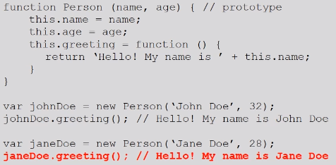

### Extending prototypes

- Prototypes can extend another prototype with more functionality
- To inherit a prototype, set the \_\_ proto__ property of an object to the parent prototype

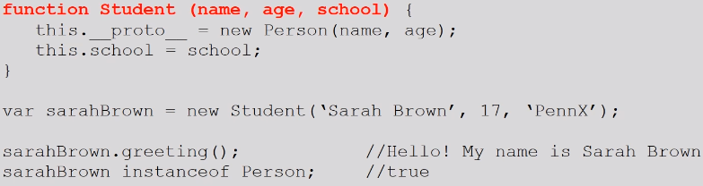

### Prototype properties

- Properties and methods can be added to prototypes by adding them to the prototype property

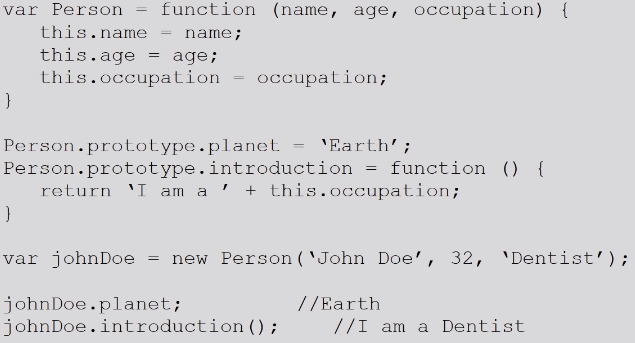