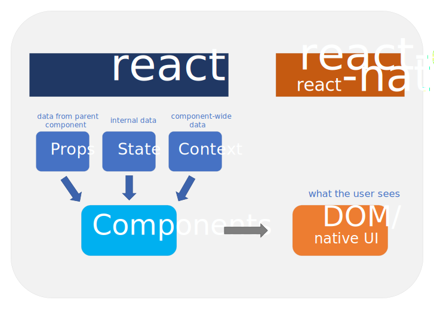

React is comprised of two main libraries, [react](https://www.npmjs.com/package/react) and [react-dom](https://www.npmjs.com/package/react-dom). The `react` package contains only the functionality necessary to define React components. It is typically used together with a React renderer like `react-dom` for the web, or `react-native` for the native environments.



In summary, while `react` handles the creation of components, renderers handle the displaying.

## react-dom

While `react` determines:

- how the component tree currently looks like and
- what it should look like (e.g. when data changes)

`react-dom` receives:

- the differences (the required changes) and
- manipulates the real DOM as a consequence

### Updates to the DOM

The re-execution of a component function doesn't mean that the DOM is re-rendered. Components are re-evaluated whenever props, state or context changes. React uses the virtual DOM as a representation of the actual DOM. React computes the necessary changes by using an in-memory version of the DOM, and rerenders the minimal amount necessary.


### Example of a re-render

Let's assume the current state of the DOM looks like this:

```html
<div>
  <h1>Hello World</h1>
</div>
```

Now assume that after a new evaluation the DOM should look like this:

```html {3}
<div>
  <h1>Hello World</h1>
  <p>This is a paragraph</p>
</div>
```

The only required change is to add a new `<p>` element. React will compute the difference between the two DOM trees and will only add the new `<p>` element.
