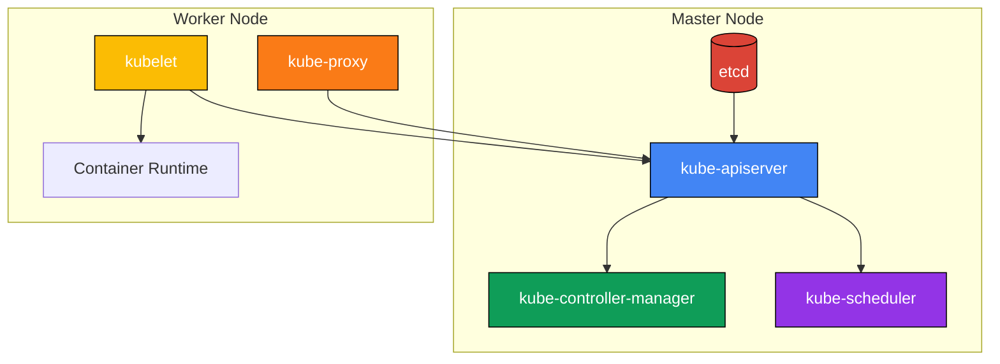

This diagram shows the main components of a Kubernetes cluster:

## Master Node Components

### etcd

- Key-value store that stores all cluster data
- Can be distributed across different nodes in the cluster

### Kube API Server

- API server that exposes the Kubernetes API

#### Example: Create pod

1. Authenticates user
2. Validates request
3. Retrieves data
4. Update ETCD
5. Is being monitored by the kube-scheduler which communicates which node to place pod on
6. Communicates to kubelet to create the pod

### Kube Controller Manager

- Watches state of the system
- Brings system to desired state through the api-server
- Node Controller
  - Polls nodes every 5s
  - Grace period 40s (NotReady)
  - Eviction after 5min
- Replication Controller
  - Monitors replica sets
  - Assures desired number of pods are available

### Kube Scheduler

- Schedules pods based on available resources and affinity/taints
- Process:
  1. Filter nodes
  2. Rank nodes

## Worker Node Components

### Kubelet

- Agent that runs on each node and ensures containers are running in a pod
- Monitors nodes & pods and reports to the api-server
- Registers the node with the cluster

### Kube Proxy

- Network proxy that maintains network rules on nodes (to forward traffic to services)
- Maps IP of service to IP of the right pod

### Container Runtime

- Software responsible for running containers (e.g., Docker, containerd)
